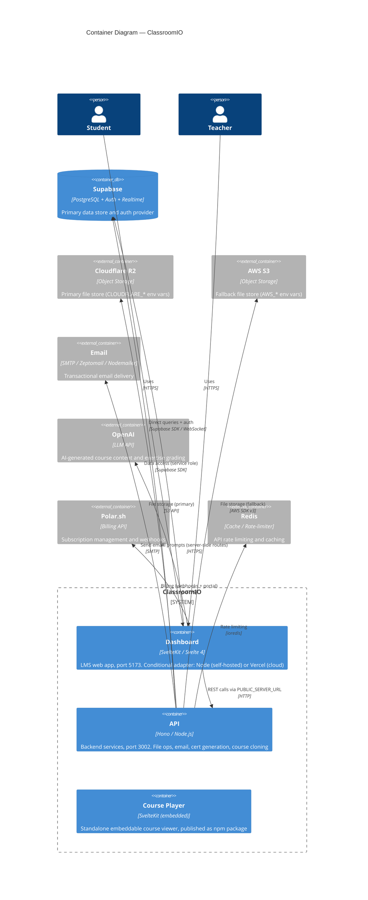

# Layer 2: Container

```mermaid
C4Container
  title Container Diagram — ClassroomIO

  Person(student, "Student")
  Person(teacher, "Teacher")

  System_Boundary(cio, "ClassroomIO") {
    Container(dashboard, "Dashboard", "SvelteKit / Svelte 4", "LMS web app, port 5173. Conditional adapter: Node (self-hosted) or Vercel (cloud)")
    Container(api, "API", "Hono / Node.js", "Backend services, port 3002. File ops, email, cert generation, course cloning")
    Container(courseapp, "Course Player", "SvelteKit (embedded)", "Standalone embeddable course viewer, published as npm package")
  }

  ContainerDb(supabase, "Supabase", "PostgreSQL + Auth + Realtime", "Primary data store and auth provider")
  Container_Ext(r2, "Cloudflare R2", "Object Storage", "Primary file store (CLOUDFLARE_* env vars)")
  Container_Ext(s3, "AWS S3", "Object Storage", "Fallback file store (AWS_* env vars)")
  Container_Ext(smtp, "Email", "SMTP / Zeptomail / Nodemailer", "Transactional email delivery")
  Container_Ext(openai, "OpenAI", "LLM API", "AI-generated course content and exercise grading")
  Container_Ext(polar, "Polar.sh", "Billing API", "Subscription management and webhooks")
  Container_Ext(redis, "Redis", "Cache / Rate-limiter", "API rate limiting and caching")

  Rel(student, dashboard, "Uses", "HTTPS")
  Rel(teacher, dashboard, "Uses", "HTTPS")
  Rel(dashboard, api, "REST calls via PUBLIC_SERVER_URL", "HTTP")
  Rel(dashboard, supabase, "Direct queries + auth", "Supabase SDK / WebSocket")
  Rel(api, supabase, "Data access (service role)", "Supabase SDK")
  Rel(api, r2, "File storage (primary)", "S3 API")
  Rel(api, s3, "File storage (fallback)", "AWS SDK v3")
  Rel(api, smtp, "Send email", "SMTP")
  Rel(api, redis, "Rate limiting", "ioredis")
  Rel(dashboard, openai, "AI prompts (server-side routes)", "HTTPS")
  Rel(dashboard, polar, "Billing (webhooks + portal)", "HTTPS")
```
