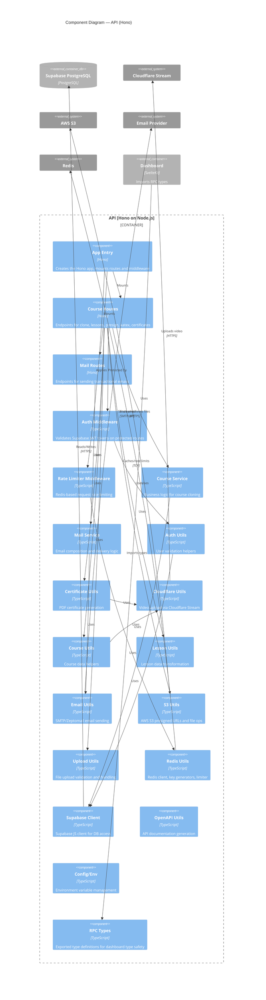

# Layer 3: API Components

Internal structure of the API container (`apps/api`), a Hono-based REST API.

```mermaid
C4Component
    title Component Diagram — API (Hono)

    Container_Boundary(api, "API [Hono on Node.js]") {
        Component(appEntry, "App Entry", "Hono", "Creates the Hono app, mounts routes and middleware")
        Component(courseRoutes, "Course Routes", "Hono", "Endpoints for clone, lessons, presign, katex, certificates")
        Component(mailRoutes, "Mail Routes", "Hono", "Endpoints for sending transactional emails")

        Component(authMiddleware, "Auth Middleware", "TypeScript", "Validates Supabase JWT tokens on protected routes")
        Component(rateLimiter, "Rate Limiter Middleware", "TypeScript", "Redis-based request rate limiting")

        Component(courseService, "Course Service", "TypeScript", "Business logic for course cloning")
        Component(mailService, "Mail Service", "TypeScript", "Email composition and delivery logic")

        Component(authUtils, "Auth Utils", "TypeScript", "User validation helpers")
        Component(certificateUtils, "Certificate Utils", "TypeScript", "PDF certificate generation")
        Component(cloudflareUtils, "Cloudflare Utils", "TypeScript", "Video upload via Cloudflare Stream")
        Component(courseUtils, "Course Utils", "TypeScript", "Course data helpers")
        Component(lessonUtils, "Lesson Utils", "TypeScript", "Lesson data transformation")
        Component(emailUtils, "Email Utils", "TypeScript", "SMTP/Zeptomail email sending")
        Component(s3Utils, "S3 Utils", "TypeScript", "AWS S3 presigned URLs and file ops")
        Component(uploadUtils, "Upload Utils", "TypeScript", "File upload validation and handling")
        Component(redisUtils, "Redis Utils", "TypeScript", "Redis client, key generators, limiter")
        Component(supabaseUtils, "Supabase Client", "TypeScript", "Supabase JS client for DB access")
        Component(openapiUtils, "OpenAPI Utils", "TypeScript", "API documentation generation")
        Component(configEnv, "Config/Env", "TypeScript", "Environment variable management")
        Component(rpcTypes, "RPC Types", "TypeScript", "Exported type definitions for dashboard type safety")
    }

    ContainerDb_Ext(db, "Supabase PostgreSQL", "PostgreSQL", "")
    System_Ext(cloudflare, "Cloudflare Stream", "", "")
    System_Ext(s3, "AWS S3", "", "")
    System_Ext(emailProvider, "Email Provider", "", "")
    System_Ext(redis, "Redis", "", "")
    Container_Ext(dashboardApp, "Dashboard", "SvelteKit", "Imports RPC types")

    Rel(appEntry, courseRoutes, "Mounts")
    Rel(appEntry, mailRoutes, "Mounts")
    Rel(appEntry, rateLimiter, "Applies")

    Rel(courseRoutes, authMiddleware, "Protected by")
    Rel(courseRoutes, courseService, "Uses")
    Rel(courseRoutes, certificateUtils, "Uses")
    Rel(courseRoutes, courseUtils, "Uses")
    Rel(courseRoutes, lessonUtils, "Uses")
    Rel(courseRoutes, s3Utils, "Uses")
    Rel(courseRoutes, uploadUtils, "Uses")

    Rel(mailRoutes, mailService, "Uses")

    Rel(authMiddleware, authUtils, "Uses")
    Rel(authUtils, supabaseUtils, "Uses")

    Rel(rateLimiter, redisUtils, "Uses")

    Rel(courseService, supabaseUtils, "Uses")
    Rel(mailService, emailUtils, "Uses")

    Rel(certificateUtils, cloudflareUtils, "Uses")
    Rel(courseUtils, cloudflareUtils, "Uses")

    Rel(supabaseUtils, db, "Reads/Writes", "HTTPS")
    Rel(cloudflareUtils, cloudflare, "Uploads video", "HTTPS")
    Rel(s3Utils, s3, "Stores/retrieves files", "HTTPS")
    Rel(emailUtils, emailProvider, "Sends email", "SMTP/API")
    Rel(redisUtils, redis, "Caches/rate limits", "TCP")

    Rel(dashboardApp, rpcTypes, "Imports types")
```
