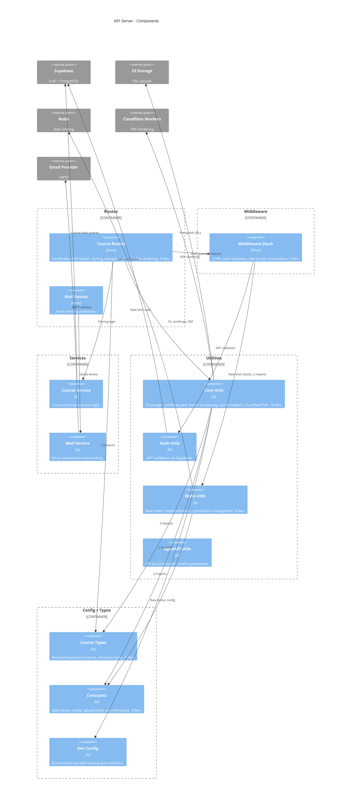

# ClassroomIO - Layer 3: API Server Components

```mermaid
C4Component
  title API Server - Components

  UpdateLayoutConfig($c4ShapeInRow="3", $c4BoundaryInRow="2")

  Container_Boundary(routes_boundary, "Routes") {
    Component(routes_course, "Course Routes", "Hono", "Certificates, PDF export, cloning, presigned URLs, KaTeX rendering. 5 files.")
    Component(routes_mail, "Mail Routes", "Hono", "Email sending endpoints.")
  }

  Container_Boundary(middleware_boundary, "Middleware") {
    Component(middlewares, "Middleware Stack", "Hono", "CORS, auth validation, rate limiter composition. 2 files.")
  }

  Container_Boundary(services_boundary, "Services") {
    Component(svc_course, "Course Service", "ts", "Course cloning business logic.")
    Component(svc_mail, "Mail Service", "ts", "Email composition and sending.")
  }

  Container_Boundary(utils_boundary, "Utilities") {
    Component(utils, "Core Utils", "ts", "S3 presign, certificate gen, lesson processing, course helpers, Cloudflare PDF. 10 files.")
    Component(utils_auth, "Auth Utils", "ts", "JWT validation via Supabase.")
    Component(utils_redis, "Redis Utils", "ts", "Rate limiter implementation, connection management. 3 files.")
    Component(utils_openapi, "OpenAPI Utils", "ts", "API documentation schema generation.")
  }

  Container_Boundary(config_boundary, "Config + Types") {
    Component(types_course, "Course Types", "ts", "Request/response schemas, database types. 2 files.")
    Component(constants, "Constants", "ts", "Rate limiter config, upload limits, env references. 3 files.")
    Component(config_env, "Env Config", "ts", "Environment variable loading and validation.")
  }

  %% External systems
  System_Ext(supabase, "Supabase", "Auth + PostgreSQL")
  System_Ext(s3, "S3 Storage", "File uploads")
  System_Ext(redis_ext, "Redis", "Rate limiting")
  System_Ext(cloudflare, "Cloudflare Workers", "PDF rendering")
  System_Ext(email_ext, "Email Provider", "SMTP")

  %% Routes -> Middleware (top-down)
  Rel_D(routes_course, middlewares, "Auth guard, 2 imports")
  Rel_D(routes_course, types_course, "4 imports")
  Rel_D(routes_course, svc_course, "Cloning logic")
  Rel_D(routes_course, utils, "S3, certificate, PDF")

  %% Mail routes
  Rel_D(routes_mail, svc_mail, "Sends emails")

  %% Middleware -> Utils
  Rel_D(middlewares, utils_redis, "Rate limit checks, 2 imports")
  Rel_D(middlewares, utils_auth, "JWT validation")

  %% Utils -> Config/Types
  Rel_D(utils, types_course, "3 imports")
  Rel_D(utils, constants, "2 imports")
  Rel_D(utils, config_env, "2 imports")
  Rel_R(utils_redis, constants, "Rate limiter config")

  %% Utils -> External systems
  Rel_D(utils_auth, supabase, "JWT verification")
  Rel_D(utils_redis, redis_ext, "Rate limit state")
  Rel_D(utils, s3, "Presigned URLs")
  Rel_D(utils, cloudflare, "PDF rendering")
  Rel_D(svc_mail, email_ext, "SMTP delivery")
  Rel_D(svc_course, supabase, "Course data queries")

  UpdateRelStyle(utils, types_course, $offsetX="10", $offsetY="10")
  UpdateRelStyle(routes_course, types_course, $offsetX="-10", $offsetY="-10")
```
