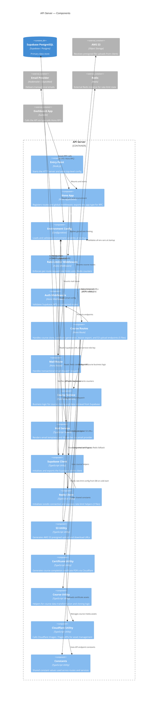

# L3 — API Server Components

> Generated: 2026-03-13

```mermaid
C4Component
  title API Server — Components

  Container_Boundary(api, "API Server") {
    Component(index_ts, "Entry Point", "Node.js", "Starts the HTTP server and wires top-level config")
    Component(app_ts, "Hono App", "Hono Application", "Registers routes and global middleware; exports the app type for RPC")
    Component(config_env_ts, "Environment Config", "Configuration", "Loads and validates environment variables at startup")
    Component(middlewares_rate_limiter_ts, "Rate Limiter Middleware", "Hono Middleware", "Enforces per-route request rate limits using Redis counters")
    Component(middlewares_auth_ts, "Auth Middleware", "Hono Middleware", "Validates Supabase JWTs on protected routes")
    Component(routes_course, "Course Routes", "Hono Route", "Handles course clone, certificate generation, lesson export, and S3 upload endpoints (5 files)")
    Component(routes_mail_ts, "Mail Route", "Hono Route", "Handles transactional email dispatch requests")
    Component(services_course, "Course Service", "TypeScript Service", "Business logic for course cloning and data retrieval from Supabase")
    Component(services_mail_ts, "Mail Service", "TypeScript Service", "Renders email templates and dispatches via email provider")
    Component(utils_supabase_ts, "Supabase Client", "TypeScript Utility", "Initialises and exports the Supabase admin client")
    Component(utils_redis, "Redis Client", "TypeScript Utility", "Initialises ioredis connection and exposes rate-limit helpers (3 files)")
    Component(utils_s3_ts, "S3 Utility", "TypeScript Utility", "Generates AWS S3 presigned upload and download URLs")
    Component(utils_certificate_ts, "Certificate Utility", "TypeScript Utility", "Generates course completion certificate PDFs via Cloudflare")
    Component(utils_course_ts, "Course Utility", "TypeScript Utility", "Helpers for course data transformation and cloning logic")
    Component(utils_cloudflare_ts, "Cloudflare Utility", "TypeScript Utility", "Calls Cloudflare Images / Pages APIs for asset management")
    Component(constants_index_ts, "Constants", "TypeScript Utility", "Shared constant values used across routes and services")
  }

  ContainerDb(supabase_db, "Supabase PostgreSQL", "Supabase / Postgres", "Primary data store")
  Container_Ext(awss3, "AWS S3", "Object Storage", "Receives presigned file uploads from clients")
  Container_Ext(email_provider, "Email Provider", "Nodemailer / ZeptoMail", "Delivers transactional emails")
  Container_Ext(redis_ext, "Redis", "Redis", "External Redis instance for rate-limit state")
  Container_Ext(dashboard, "Dashboard App", "SvelteKit", "Calls the API via type-safe Hono RPC")

  Rel(dashboard, app_ts, "Issues RPC calls", "HTTPS / Hono RPC")
  Rel(index_ts, app_ts, "Mounts and starts")
  Rel(index_ts, config_env_ts, "Reads port and environment")
  Rel(app_ts, middlewares_rate_limiter_ts, "Applies global rate limiting")
  Rel(app_ts, routes_course, "Mounts course routes")
  Rel(app_ts, routes_mail_ts, "Mounts mail route")
  Rel(middlewares_rate_limiter_ts, utils_redis, "Checks and increments counters")
  Rel(middlewares_auth_ts, utils_supabase_ts, "Verifies JWT with Supabase")
  Rel(routes_course, middlewares_auth_ts, "Protects endpoints")
  Rel(routes_course, services_course, "Delegates course business logic")
  Rel(routes_course, utils_certificate_ts, "Generates certificates")
  Rel(routes_course, utils_course_ts, "Uses course helpers")
  Rel(routes_course, utils_s3_ts, "Gets presigned S3 URLs")
  Rel(routes_course, constants_index_ts, "Uses shared constants")
  Rel(routes_mail_ts, services_mail_ts, "Delegates email dispatch")
  Rel(routes_mail_ts, config_env_ts, "Reads email config")
  Rel(services_course, utils_supabase_ts, "Queries course data")
  Rel(services_mail_ts, utils_supabase_ts, "Reads org email settings via Redis fallback")
  Rel(utils_certificate_ts, utils_cloudflare_ts, "Uploads certificate assets")
  Rel(utils_course_ts, utils_cloudflare_ts, "Manages course media assets")
  Rel(utils_cloudflare_ts, constants_index_ts, "Uses API endpoint constants")
  Rel(utils_redis, utils_supabase_ts, "Reads rate-limit config from DB on cold start")
  Rel(utils_redis, config_env_ts, "Reads Redis connection URL")
  Rel(utils_supabase_ts, config_env_ts, "Reads Supabase URL and service-role key")
  Rel(config_env_ts, config_env_ts, "Validates all env vars at startup")
  Rel(services_mail_ts, email_provider, "Sends emails", "SMTP / ZeptoMail API")
  Rel(utils_s3_ts, awss3, "Issues presigned URLs", "HTTPS / AWS SDK")
  Rel(utils_redis, redis_ext, "Rate-limit state", "TCP / ioredis")
  Rel(utils_supabase_ts, supabase_db, "Admin queries", "HTTPS / Supabase JS")

  UpdateLayoutConfig($c4ShapeInRow="4", $c4BoundaryInRow="1")
```
