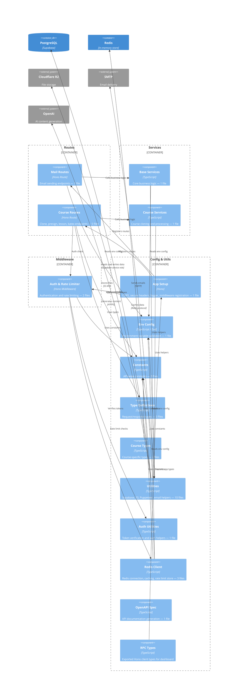

# Layer 3 — API Components

Component diagram for the API container (`apps/api`), derived from AST extraction.

```mermaid
C4Component
  Container_Boundary(routes_boundary, "Routes") {
    Component(mail_routes, "Mail Routes", "Hono Route", "Email sending endpoints — 1 file")
    Component(course_routes, "Course Routes", "Hono Route", "Clone, presign, lesson, katex endpoints — 5 files")
  }

  Container_Boundary(services_boundary, "Services") {
    Component(base_services, "Base Services", "TypeScript", "Core business logic — 1 file")
    Component(course_services, "Course Services", "TypeScript", "Course cloning and processing — 1 file")
  }

  Container_Boundary(middleware_boundary, "Middleware") {
    Component(middlewares, "Auth & Rate Limiter", "Hono Middleware", "Authentication and rate limiting — 2 files")
  }

  Container_Boundary(config_boundary, "Config & Utils") {
    Component(app, "App Setup", "Hono", "CORS, secure headers, logger, middleware registration — 1 file")
    Component(config, "Env Config", "TypeScript / Zod", "Environment variable validation — 1 file")
    Component(constants, "Constants", "TypeScript", "API-wide constants — 3 files")
    Component(types, "Type Definitions", "TypeScript", "Request/response types — 3 files")
    Component(course_types, "Course Types", "TypeScript", "Course-specific types — 2 files")
    Component(utils, "Utilities", "TypeScript", "Supabase, S3, Puppeteer, email helpers — 10 files")
    Component(auth_utils, "Auth Utilities", "TypeScript", "Token verification and auth helpers — 1 file")
    Component(redis, "Redis Client", "TypeScript", "Redis connection, caching, rate limit store — 3 files")
    Component(openapi, "OpenAPI Spec", "TypeScript", "API documentation generation — 1 file")
    Component(rpc_types, "RPC Types", "TypeScript", "Exported Hono client types for dashboard")
  }

  ContainerDb(postgres, "PostgreSQL", "Supabase")
  Container(redis_store, "Redis", "In-memory store")
  System_Ext(r2, "Cloudflare R2", "File storage")
  System_Ext(smtp, "SMTP", "Email delivery")
  System_Ext(openai, "OpenAI", "AI content generation")

  Rel(app, mail_routes, "Registers routes")
  Rel(app, course_routes, "Registers routes")
  Rel(app, middlewares, "Applies middleware")
  Rel(course_routes, course_services, "Calls business logic")
  Rel(course_routes, middlewares, "Auth check")
  Rel(course_routes, constants, "Uses constants")
  Rel(course_routes, types, "Uses types")
  Rel(mail_routes, base_services, "Calls business logic")
  Rel(mail_routes, config, "Reads env config")
  Rel(base_services, utils, "Uses helpers")
  Rel(base_services, config, "Reads env config")
  Rel(course_services, utils, "Uses helpers")
  Rel(middlewares, auth_utils, "Verifies tokens")
  Rel(middlewares, redis, "Rate limit checks")
  Rel(middlewares, constants, "Uses constants")
  Rel(utils, config, "Reads env config")
  Rel(utils, constants, "Uses constants")
  Rel(redis, config, "Reads env config")
  Rel(redis, constants, "Uses constants")
  Rel(course_types, constants, "Uses constants")
  Rel(rpc_types, app, "Exports app types")
  Rel(utils, postgres, "Reads and writes data", "Supabase service role")
  Rel(utils, r2, "Stores files", "S3 API")
  Rel(utils, smtp, "Sends emails", "SMTP")
  Rel(utils, openai, "Generates content", "HTTPS")
  Rel(redis, redis_store, "Caches data", "Redis protocol")
```

<!-- Generated 2026-03-13 from extracted-components.json -->
