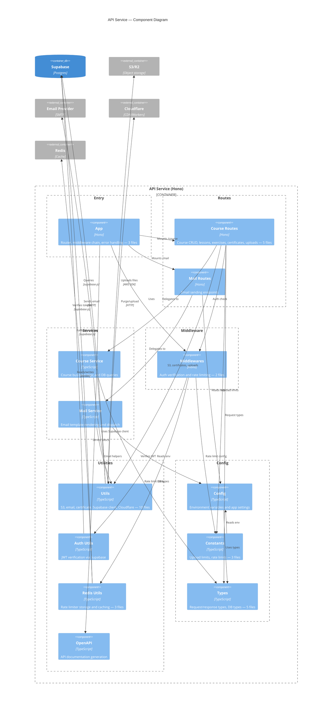

# L3 — API Service Components

Derived from AST extraction (depth=2).

```mermaid
C4Component
  title API Service — Component Diagram

  Container_Boundary(api, "API Service (Hono)") {

    Boundary(entry, "Entry", "") {
      Component(app, "App", "Hono", "Router, middleware chain, error handling — 3 files")
    }

    Boundary(routes_b, "Routes", "") {
      Component(routes_course, "Course Routes", "Hono", "Course CRUD, lessons, exercises, certificates, uploads — 5 files")
      Component(routes_mail, "Mail Routes", "Hono", "Email sending endpoints")
    }

    Boundary(services_b, "Services", "") {
      Component(svc_course, "Course Service", "TypeScript", "Course business logic and DB queries")
      Component(svc_mail, "Mail Service", "TypeScript", "Email template rendering and dispatch")
    }

    Boundary(middleware_b, "Middleware", "") {
      Component(middlewares, "Middlewares", "Hono", "Auth verification and rate limiting — 2 files")
    }

    Boundary(utils_b, "Utilities", "") {
      Component(utils, "Utils", "TypeScript", "S3, email, certificate, Supabase client, Cloudflare — 10 files")
      Component(utils_auth, "Auth Utils", "TypeScript", "JWT verification via Supabase")
      Component(utils_redis, "Redis Utils", "TypeScript", "Rate limiter storage and caching — 3 files")
      Component(utils_openapi, "OpenAPI", "TypeScript", "API documentation generation")
    }

    Boundary(config_b, "Config", "") {
      Component(config, "Config", "TypeScript", "Environment variables and app settings")
      Component(constants, "Constants", "TypeScript", "Upload limits, rate limits — 3 files")
      Component(types, "Types", "TypeScript", "Request/response types, DB types — 5 files")
    }
  }

  ContainerDb(db, "Supabase", "Postgres")
  Container_Ext(s3, "S3/R2", "Object storage")
  Container_Ext(email_provider, "Email Provider", "SMTP")
  Container_Ext(cloudflare, "Cloudflare", "CDN/Workers")
  Container_Ext(redis, "Redis", "Cache")

  Rel(app, routes_course, "Mounts /course")
  Rel(app, routes_mail, "Mounts /mail")
  Rel(app, middlewares, "Uses")
  Rel(app, utils_openapi, "Serves /docs")

  Rel(routes_course, svc_course, "Delegates to")
  Rel(routes_course, middlewares, "Auth check")
  Rel(routes_course, constants, "Upload limits")
  Rel(routes_course, types, "Request types")
  Rel(routes_course, utils, "S3, certificates, uploads")

  Rel(routes_mail, svc_mail, "Delegates to")
  Rel(routes_mail, config, "Reads env")

  Rel(svc_course, utils, "Uses Supabase client")
  Rel(svc_course, types, "DB types")
  Rel(svc_mail, config, "Reads env")
  Rel(svc_mail, utils, "Email helpers")

  Rel(middlewares, utils_auth, "Verifies JWT")
  Rel(middlewares, utils_redis, "Rate limit state")
  Rel(middlewares, constants, "Rate limit config")

  Rel(utils_auth, db, "Verifies tokens", "supabase-js")
  Rel(utils_redis, redis, "Reads/writes", "ioredis")
  Rel(utils_redis, db, "Fallback queries", "supabase-js")
  Rel(utils, db, "Queries", "supabase-js")
  Rel(utils, s3, "Uploads files", "AWS SDK")
  Rel(utils, email_provider, "Sends email", "SMTP")
  Rel(utils, cloudflare, "Purge/upload", "HTTP")

  Rel(config, types, "Uses types")
  Rel(constants, config, "Reads env")
```
