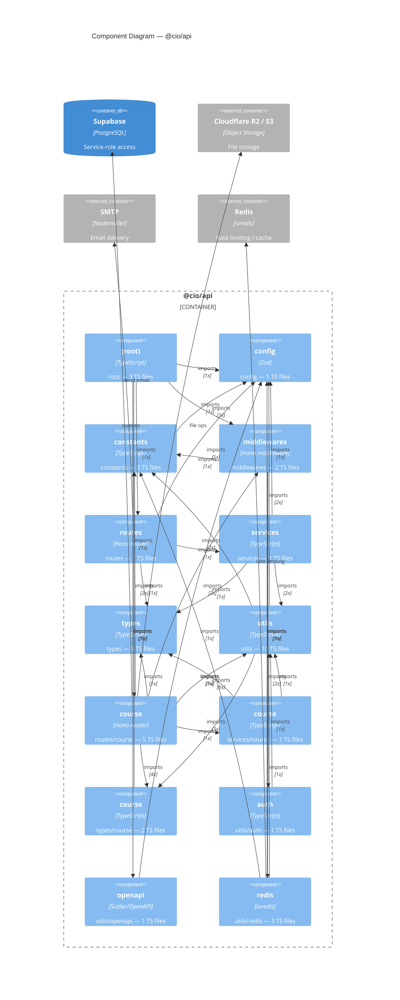

# Layer 3: Components — @cio/api

> Extracted at depth=2. 14 components, 32 cross-component imports.

```mermaid
C4Component
  title Component Diagram — @cio/api

  Container_Boundary(api_b, "@cio/api") {
    Component(api_root, "(root)", "TypeScript", "root — 3 TS files")
    Component(api_config, "config", "Zod", "config — 1 TS files")
    Component(api_constants, "constants", "TypeScript", "constants — 3 TS files")
    Component(api_middlewares, "middlewares", "Hono middleware", "middlewares — 2 TS files")
    Component(api_routes, "routes", "Hono router", "routes — 1 TS files")
    Component(api_services, "services", "TypeScript", "services — 1 TS files")
    Component(api_types, "types", "TypeScript", "types — 3 TS files")
    Component(api_utils, "utils", "TypeScript", "utils — 10 TS files")
    Component(api_routes_course, "course", "Hono router", "routes/course — 5 TS files")
    Component(api_services_course, "course", "TypeScript", "services/course — 1 TS files")
    Component(api_types_course, "course", "TypeScript", "types/course — 2 TS files")
    Component(api_utils_auth, "auth", "TypeScript", "utils/auth — 1 TS files")
    Component(api_utils_openapi, "openapi", "Scalar/OpenAPI", "utils/openapi — 1 TS files")
    Component(api_utils_redis, "redis", "ioredis", "utils/redis — 3 TS files")
  }

  ContainerDb(api_supabase, "Supabase", "PostgreSQL", "Service-role access")
  Container_Ext(api_r2, "Cloudflare R2 / S3", "Object Storage", "File storage")
  Container_Ext(api_smtp, "SMTP", "Nodemailer", "Email delivery")
  Container_Ext(api_redis, "Redis", "ioredis", "Rate limiting / cache")

  Rel(api_root, api_routes_course, "imports", "1x")
  Rel(api_root, api_routes, "imports", "1x")
  Rel(api_root, api_middlewares, "imports", "1x")
  Rel(api_root, api_utils_openapi, "imports", "1x")
  Rel(api_root, api_config, "imports", "1x")
  Rel(api_constants, api_config, "imports", "1x")
  Rel(api_middlewares, api_utils_auth, "imports", "1x")
  Rel(api_middlewares, api_constants, "imports", "1x")
  Rel(api_middlewares, api_utils_redis, "imports", "2x")
  Rel(api_routes, api_services, "imports", "1x")
  Rel(api_routes, api_types, "imports", "1x")
  Rel(api_routes, api_config, "imports", "1x")
  Rel(api_services, api_utils, "imports", "2x")
  Rel(api_services, api_types, "imports", "1x")
  Rel(api_services, api_config, "imports", "1x")
  Rel(api_utils, api_types_course, "imports", "3x")
  Rel(api_utils, api_constants, "imports", "2x")
  Rel(api_utils, api_config, "imports", "2x")
  Rel(api_routes_course, api_types_course, "imports", "4x")
  Rel(api_routes_course, api_services_course, "imports", "1x")
  Rel(api_routes_course, api_middlewares, "imports", "2x")
  Rel(api_routes_course, api_types, "imports", "1x")
  Rel(api_routes_course, api_utils, "imports", "6x")
  Rel(api_routes_course, api_constants, "imports", "2x")
  Rel(api_services_course, api_utils, "imports", "1x")
  Rel(api_services_course, api_types, "imports", "1x")
  Rel(api_types_course, api_constants, "imports", "1x")
  Rel(api_utils_auth, api_utils, "imports", "1x")
  Rel(api_utils_openapi, api_config, "imports", "1x")
  Rel(api_utils_redis, api_utils, "imports", "1x")
  Rel(api_utils_redis, api_constants, "imports", "1x")
  Rel(api_utils_redis, api_config, "imports", "1x")
  Rel(api_routes_course, api_supabase, "queries")
  Rel(api_routes_course, api_r2, "file ops")
  Rel(api_routes, api_smtp, "send email")
  Rel(api_utils_redis, api_redis, "rate limiting")
```
