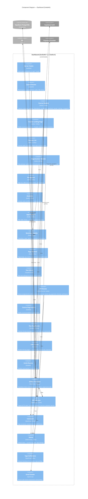

# Layer 3: Dashboard Components

Internal structure of the Dashboard container (`apps/dashboard`), the main SvelteKit LMS application.

```mermaid
C4Component
    title Component Diagram — Dashboard (SvelteKit)

    Container_Boundary(dashboard, "Dashboard [SvelteKit 1.x / Svelte 4]") {
        Component(hooksServer, "Server Hooks", "SvelteKit", "Auth token validation on /api/* routes")
        Component(layoutRoutes, "Layout Routes", "SvelteKit", "Root layout — org resolution, auth, i18n setup")

        Component(courseComponents, "Course Module", "Svelte, 91 files", "Lessons, exercises, grading, attendance, certificates, newsfeed, people, settings, navigation")
        Component(courseLandingPage, "Course Landing Page", "Svelte, 19 files", "Public course page editor — header, pricing, reviews, sections")
        Component(coursesComponents, "Courses List", "Svelte, 10 files", "Course cards, list view, create/copy course modals")
        Component(orgComponents, "Organization Module", "Svelte, 46 files", "Org settings, audience, community, quiz, billing, team members, sidebar")
        Component(navigationComponents, "Navigation", "Svelte, 8 files", "App nav, LMS nav, mobile menu, auth buttons")
        Component(analyticsComponents, "Analytics", "Svelte, 4 files", "Activity cards, profile cards, loading states")
        Component(appsComponents, "Apps Module", "Svelte, 15 files", "Poll, Q&A, Notes — in-course interactive apps")
        Component(questionComponents, "Question Module", "Svelte, 7 files", "Checkbox, radio, textarea questions and grading")
        Component(pageComponents, "Page Module", "Svelte, 6 files", "Page body, nav, not-found, restricted, unauthorized")
        Component(textEditor, "Text Editor", "TinyMCE/Svelte", "Rich text editing for lessons and content")

        Component(apiRoutes, "API Routes", "SvelteKit server routes", "Server endpoints for admin, analytics, courses, email, org, payments, domain verification")
        Component(courseSlugRoutes, "Course Slug Routes", "SvelteKit", "Public course enrollment page routes")
        Component(orgSlugRoutes, "Org Slug Routes", "SvelteKit, 22 files", "Teacher-facing org pages — courses, settings, community")
        Component(lmsRoutes, "LMS Routes", "SvelteKit", "Student-facing pages — my learning, community, exercises")
        Component(inviteRoutes, "Invite Routes", "SvelteKit", "Student and teacher invite handling")

        Component(utilsFunctions, "Utility Functions", "TypeScript, 52 files", "Supabase client, translations, auth helpers, org/course utils")
        Component(utilsServices, "API Services", "TypeScript, 21 files", "Typed HTTP client, Supabase queries, AI service, payment service")
        Component(utilsConstants, "Constants", "TypeScript, 9 files", "App constants, translations, role definitions")
        Component(utilsStore, "Stores", "Svelte stores, 5 files", "Global state — current org, user, app settings")
        Component(utilsTypes, "Type Definitions", "TypeScript, 9 files", "Shared interfaces for courses, orgs, profiles")
        Component(sendEmail, "Email Sender", "TypeScript", "Server-side email composition and sending")
    }

    ContainerDb_Ext(db, "Supabase PostgreSQL", "PostgreSQL", "")
    System_Ext(supabaseAuth, "Supabase Auth", "", "")
    Container_Ext(apiApp, "API", "Hono", "")
    System_Ext(payment, "Payment Provider", "", "")

    Rel(hooksServer, utilsServices, "Uses")
    Rel(layoutRoutes, utilsFunctions, "Uses")
    Rel(layoutRoutes, utilsStore, "Uses")

    Rel(courseComponents, utilsFunctions, "Uses")
    Rel(courseComponents, utilsServices, "Uses")
    Rel(courseComponents, utilsConstants, "Uses")
    Rel(courseComponents, questionComponents, "Uses")

    Rel(coursesComponents, utilsFunctions, "Uses")
    Rel(orgComponents, utilsFunctions, "Uses")
    Rel(appsComponents, utilsFunctions, "Uses")

    Rel(apiRoutes, utilsFunctions, "Uses")
    Rel(apiRoutes, utilsServices, "Uses")
    Rel(apiRoutes, sendEmail, "Uses")

    Rel(utilsFunctions, utilsServices, "Uses")
    Rel(utilsFunctions, utilsStore, "Uses")
    Rel(utilsFunctions, utilsConstants, "Uses")
    Rel(utilsServices, utilsFunctions, "Uses")
    Rel(utilsServices, utilsStore, "Uses")

    Rel(utilsServices, db, "Reads/Writes", "HTTPS")
    Rel(utilsFunctions, supabaseAuth, "Authenticates", "HTTPS")
    Rel(utilsServices, apiApp, "Calls API", "HTTPS/JSON")
    Rel(apiRoutes, payment, "Processes payments", "HTTPS")
```
