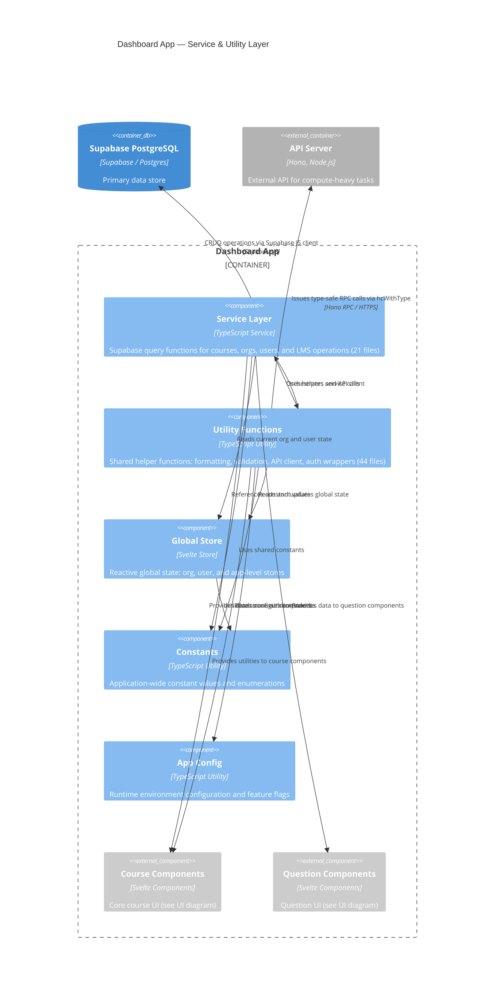

# L3 — Dashboard: Service & Utility Layer

> Generated: 2026-03-13

```mermaid
C4Component
  title Dashboard App — Service & Utility Layer

  Container_Boundary(dashboard, "Dashboard App") {
    Component(lib_utils_services, "Service Layer", "TypeScript Service", "Supabase query functions for courses, orgs, users, and LMS operations (21 files)")
    Component(lib_utils_functions, "Utility Functions", "TypeScript Utility", "Shared helper functions: formatting, validation, API client, auth wrappers (44 files)")
    Component(lib_utils_store, "Global Store", "Svelte Store", "Reactive global state: org, user, and app-level stores")
    Component(lib_utils_constants, "Constants", "TypeScript Utility", "Application-wide constant values and enumerations")
    Component(lib_config_ts, "App Config", "TypeScript Utility", "Runtime environment configuration and feature flags")

    Component_Ext(lib_components_Course, "Course Components", "Svelte Components", "Core course UI (see UI diagram)")
    Component_Ext(lib_components_Question, "Question Components", "Svelte Components", "Question UI (see UI diagram)")
  }

  ContainerDb(supabase_db, "Supabase PostgreSQL", "Supabase / Postgres", "Primary data store")
  Container_Ext(api_server, "API Server", "Hono, Node.js", "External API for compute-heavy tasks")

  Rel(lib_utils_services, lib_utils_functions, "Uses helpers and API client")
  Rel(lib_utils_services, lib_utils_constants, "References constant values")
  Rel(lib_utils_services, lib_utils_store, "Reads current org and user state")
  Rel(lib_utils_services, lib_components_Course, "Provides data to course components")
  Rel(lib_utils_services, lib_components_Question, "Provides data to question components")
  Rel(lib_utils_functions, lib_utils_services, "Orchestrates service calls")
  Rel(lib_utils_functions, lib_utils_constants, "Uses shared constants")
  Rel(lib_utils_functions, lib_utils_store, "Reads and updates global state")
  Rel(lib_utils_functions, lib_config_ts, "Reads configuration values")
  Rel(lib_utils_functions, lib_components_Course, "Provides utilities to course components")
  Rel(lib_utils_store, lib_utils_constants, "Initialises store with constants")
  Rel(lib_utils_services, supabase_db, "CRUD operations via Supabase JS client", "Supabase JS")
  Rel(lib_utils_functions, api_server, "Issues type-safe RPC calls via hcWithType", "Hono RPC / HTTPS")

  UpdateLayoutConfig($c4ShapeInRow="3", $c4BoundaryInRow="1")
```
