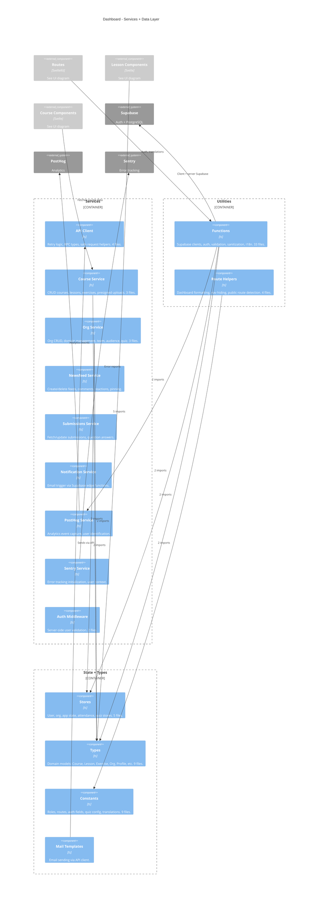

# ClassroomIO - Layer 3: Dashboard Services + Data

```mermaid
C4Component
  title Dashboard - Services + Data Layer
  %% See also: L3-dashboard-ui.md for the UI + Routes layer

  UpdateLayoutConfig($c4ShapeInRow="4", $c4BoundaryInRow="2")

  %% External UI references
  Component_Ext(routes, "Routes", "SvelteKit", "See UI diagram")
  Component_Ext(lesson_ui, "Lesson Components", "Svelte", "See UI diagram")
  Component_Ext(course_ui, "Course Components", "Svelte", "See UI diagram")

  Container_Boundary(services_boundary, "Services") {
    Component(svc_api, "API Client", "ts", "Retry logic, RPC types, safe request helpers. 4 files.")
    Component(svc_courses, "Course Service", "ts", "CRUD courses, lessons, exercises, presigned uploads. 3 files.")
    Component(svc_org, "Org Service", "ts", "Org CRUD, domain management, team, audience, quiz. 3 files.")
    Component(svc_newsfeed, "Newsfeed Service", "ts", "Create/delete feeds, comments, reactions, pinning.")
    Component(svc_submissions, "Submissions Service", "ts", "Fetch/update submissions, question answers.")
    Component(svc_notification, "Notification Service", "ts", "Email trigger via Supabase edge functions.")
    Component(svc_posthog, "PostHog Service", "ts", "Analytics event capture, user identification.")
    Component(svc_sentry, "Sentry Service", "ts", "Error tracking initialization, user context.")
    Component(svc_middlewares, "Auth Middleware", "ts", "Server-side user validation. 2 files.")
  }

  Container_Boundary(utils_boundary, "Utilities") {
    Component(utils_functions, "Functions", "ts", "Supabase clients, auth, validation, sanitization, i18n. 33 files.")
    Component(utils_routes, "Route Helpers", "ts", "Dashboard formatting, nav hiding, public route detection. 4 files.")
  }

  Container_Boundary(state_boundary, "State + Types") {
    Component(utils_store, "Stores", "ts", "User, org, app state, attendance, quiz stores. 5 files.")
    Component(utils_types, "Types", "ts", "Domain models: Course, Lesson, Exercise, Org, Profile, etc. 9 files.")
    Component(utils_constants, "Constants", "ts", "Roles, routes, auth fields, quiz config, translations. 9 files.")
    Component(mail, "Mail Templates", "ts", "Email sending via API client.")
  }

  %% External systems
  System_Ext(supabase, "Supabase", "Auth + PostgreSQL")
  System_Ext(posthog_ext, "PostHog", "Analytics")
  System_Ext(sentry_ext, "Sentry", "Error tracking")

  %% Top-down: UI refs -> Services
  Rel_D(routes, utils_functions, "Auth, translations")
  Rel_D(lesson_ui, utils_types, "5 imports")
  Rel_D(course_ui, svc_courses, "Fetches course data")

  %% Services internal relationships
  Rel_D(svc_courses, utils_types, "2 imports")
  Rel_D(svc_org, utils_types, "2 imports")
  Rel_R(svc_org, utils_store, "2 imports")
  Rel_D(utils_functions, utils_store, "2 imports")
  Rel_D(utils_functions, utils_types, "2 imports")
  Rel_R(utils_functions, svc_posthog, "2 imports")
  Rel_D(utils_routes, utils_constants, "2 imports")
  Rel_R(mail, svc_api, "Sends via API")

  %% Services -> External systems
  Rel_D(utils_functions, supabase, "Client + server Supabase")
  Rel_D(svc_posthog, posthog_ext, "Analytics events")
  Rel_D(svc_sentry, sentry_ext, "Error reports")

  UpdateRelStyle(svc_courses, utils_types, $offsetX="10", $offsetY="10")
  UpdateRelStyle(svc_org, utils_types, $offsetX="-10", $offsetY="10")
```
