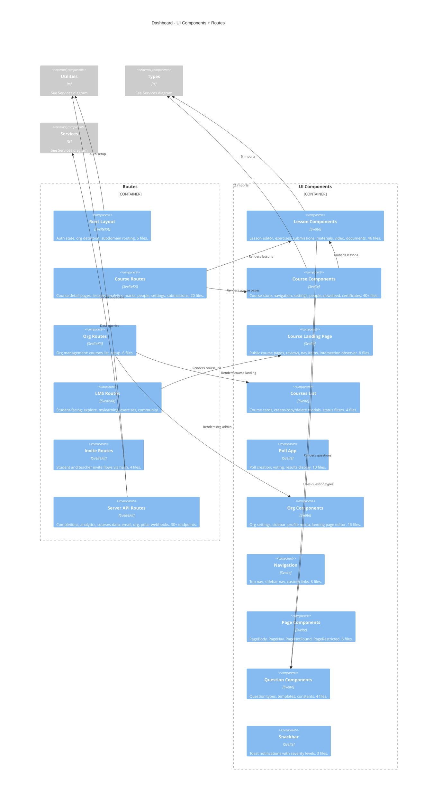

# ClassroomIO - Layer 3: Dashboard UI + Routes

```mermaid
C4Component
  title Dashboard - UI Components + Routes
  %% See also: L3-dashboard-services.md for the Services + Data layer

  UpdateLayoutConfig($c4ShapeInRow="4", $c4BoundaryInRow="2")

  Container_Boundary(routes_boundary, "Routes") {
    Component(routes, "Root Layout", "SvelteKit", "Auth state, org detection, subdomain routing. 5 files.")
    Component(routes_courses, "Course Routes", "SvelteKit", "Course detail pages: lessons, analytics, marks, people, settings, submissions. 20 files.")
    Component(routes_org, "Org Routes", "SvelteKit", "Org management: courses list, setup. 6 files.")
    Component(routes_lms, "LMS Routes", "SvelteKit", "Student-facing: explore, mylearning, exercises, community.")
    Component(routes_invite, "Invite Routes", "SvelteKit", "Student and teacher invite flows via hash. 4 files.")
    Component(routes_api, "Server API Routes", "SvelteKit", "Completions, analytics, courses data, email, org, polar webhooks. 30+ endpoints.")
  }

  Container_Boundary(ui_boundary, "UI Components") {
    Component(lesson_ui, "Lesson Components", "Svelte", "Lesson editor, exercises, submissions, materials, video, documents. 46 files.")
    Component(course_ui, "Course Components", "Svelte", "Course store, navigation, settings, people, newsfeed, certificates. 40+ files.")
    Component(landing_page, "Course Landing Page", "Svelte", "Public course pages, reviews, nav items, intersection observer. 8 files.")
    Component(courses_list, "Courses List", "Svelte", "Course cards, create/copy/delete modals, status filters. 4 files.")
    Component(poll_ui, "Poll App", "Svelte", "Poll creation, voting, results display. 10 files.")
    Component(org_ui, "Org Components", "Svelte", "Org settings, sidebar, profile menu, landing page editor. 16 files.")
    Component(navigation, "Navigation", "Svelte", "Top nav, sidebar nav, custom links. 8 files.")
    Component(page_ui, "Page Components", "Svelte", "PageBody, PageNav, PageNotFound, PageRestricted. 6 files.")
    Component(question_ui, "Question Components", "Svelte", "Question types, templates, constants. 4 files.")
    Component(snackbar, "Snackbar", "Svelte", "Toast notifications with severity levels. 3 files.")
  }

  %% External references for context
  Component_Ext(utils_functions, "Utilities", "ts", "See Services diagram")
  Component_Ext(utils_types, "Types", "ts", "See Services diagram")
  Component_Ext(services, "Services", "ts", "See Services diagram")

  %% Routes -> UI Components (top-down)
  Rel_D(routes_courses, lesson_ui, "Renders lessons")
  Rel_D(routes_courses, course_ui, "Renders course pages")
  Rel_D(routes_org, org_ui, "Renders org admin")
  Rel_D(routes_org, courses_list, "Renders course list")
  Rel_D(routes_lms, landing_page, "Renders course landing")

  %% Lateral: UI peer relationships
  Rel_R(course_ui, lesson_ui, "Embeds lessons")
  Rel_R(course_ui, question_ui, "Uses question types")
  Rel_R(lesson_ui, question_ui, "Renders questions")

  %% Down: UI -> Services/Utils (external refs)
  Rel_D(lesson_ui, utils_types, "5 imports")
  Rel_D(routes, utils_functions, "Auth setup")
  Rel_D(routes_api, services, "Data queries")
  Rel_D(routes_api, utils_functions, "Server supabase")
  Rel_D(course_ui, utils_types, "2 imports")

  UpdateRelStyle(lesson_ui, utils_types, $offsetX="10", $offsetY="10")
  UpdateRelStyle(course_ui, utils_types, $offsetX="-10", $offsetY="10")
```
