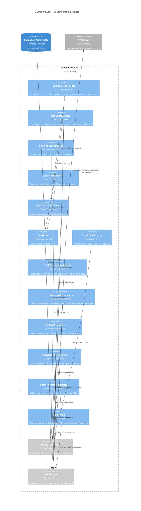

# L3 — Dashboard: UI Components & Routes

> Generated: 2026-03-13

```mermaid
C4Component
  title Dashboard App — UI Components & Routes

  Container_Boundary(dashboard, "Dashboard App") {
    Component(lib_components_Course, "Course Components", "Svelte Components", "Lesson editor, submissions, exercises, grading — core feature area (91 files)")
    Component(lib_components_Org, "Org Components", "Svelte Components", "Organisation settings, member management, and branding (46 files)")
    Component(lib_components_Courses, "Courses Components", "Svelte Components", "Course catalogue and listing views for teachers")
    Component(lib_components_Apps, "Apps Components", "Svelte Components", "Third-party integrations panel inside an organisation")
    Component(lib_components_Question, "Question Components", "Svelte Components", "Question types, rendering, and grading UI")
    Component(lib_components_Snackbar, "Snackbar", "Svelte Components", "Global toast notification UI")
    Component(routes_org_slug, "Org Admin Routes", "SvelteKit Routes", "Teacher/admin pages under /org/[slug]/")
    Component(routes_lms_community, "LMS Community Routes", "SvelteKit Routes", "Student community discussion pages under /lms/community/")
    Component(routes_api_courses, "Course API Handlers", "SvelteKit API Handler", "Server-side endpoints for course CRUD, clone, and content operations")
    Component(routes_api_email, "Email API Handlers", "SvelteKit API Handler", "Server-side endpoints that dispatch transactional emails")
    Component(routes_api_analytics, "Analytics API Handlers", "SvelteKit API Handler", "Server-side endpoints for event recording and retrieval")
    Component(routes_api_polar, "Polar Payment Handlers", "SvelteKit API Handler", "Webhook and subscription endpoints for Polar billing")
    Component(mail_sendEmail, "Send Email", "TypeScript Utility", "Thin wrapper around ZeptoMail / Nodemailer for email dispatch")

    Component_Ext(lib_utils_functions, "Utility Functions", "TypeScript Utility", "Shared utility functions (see Services diagram)")
    Component_Ext(lib_utils_services, "Service Layer", "TypeScript Service", "Supabase query services (see Services diagram)")
  }

  ContainerDb(supabase_db, "Supabase PostgreSQL", "Supabase / Postgres", "Primary data store")
  Container_Ext(api_server, "API Server", "Hono, Node.js", "External API for compute-heavy tasks")

  Rel(lib_components_Course, lib_components_Question, "Renders question components")
  Rel(lib_components_Course, lib_components_Snackbar, "Shows notifications")
  Rel(lib_components_Apps, lib_components_Snackbar, "Shows notifications")
  Rel(lib_components_Course, lib_utils_functions, "Uses shared utilities")
  Rel(lib_components_Course, lib_utils_services, "Fetches course data")
  Rel(lib_components_Apps, lib_utils_functions, "Uses shared utilities")
  Rel(lib_components_Courses, lib_utils_functions, "Uses shared utilities")
  Rel(routes_api_courses, lib_utils_functions, "Uses shared utilities")
  Rel(routes_api_courses, lib_utils_services, "Queries Supabase via services")
  Rel(routes_api_email, lib_utils_functions, "Uses shared utilities")
  Rel(routes_api_email, lib_utils_services, "Looks up recipient data")
  Rel(routes_api_email, mail_sendEmail, "Dispatches emails")
  Rel(routes_api_analytics, lib_utils_functions, "Uses shared utilities")
  Rel(routes_api_analytics, lib_utils_services, "Records analytics events")
  Rel(routes_api_polar, lib_utils_functions, "Uses shared utilities")
  Rel(routes_api_polar, lib_utils_services, "Updates subscription state")
  Rel(routes_org_slug, lib_utils_functions, "Uses shared utilities")
  Rel(mail_sendEmail, lib_utils_services, "Reads org email configuration")
  Rel(lib_utils_services, supabase_db, "Reads and writes data", "Supabase JS")
  Rel(routes_api_courses, api_server, "Delegates clone and render tasks", "Hono RPC")

  UpdateLayoutConfig($c4ShapeInRow="4", $c4BoundaryInRow="1")
```
