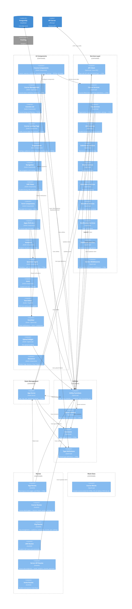

# Layer 3 — Dashboard Components

Component diagram for the Dashboard container (`apps/dashboard`), derived from AST extraction.

```mermaid
C4Component
  Container_Boundary(ui, "UI Components") {
    Component(course_components, "Course Components", "Svelte Components", "Lesson, exercise, certificate, newsfeed, people, settings — 88 files, 68 Svelte")
    Component(course_mgmt, "Course Management", "Svelte / TypeScript", "Course store, constants, functions — 3 files")
    Component(courses_list, "Courses List", "Svelte Components", "Course listing and filtering — 10 files")
    Component(course_landing, "Course Landing Page", "Svelte Components", "Public course page with sections — 19 files")
    Component(org_components, "Organization", "Svelte Components", "Settings, audience, community, quiz, landing page — 49 files")
    Component(navigation, "Navigation", "Svelte Components", "App navigation and routing — 8 files")
    Component(lms_components, "LMS Views", "Svelte Components", "Student-facing LMS interface — 3 files")
    Component(form_components, "Form Components", "Svelte Components", "Reusable form inputs — 8 files")
    Component(apps_components, "Apps (Poll etc.)", "Svelte Components", "In-course apps like polls — 15 files")
    Component(analytics_components, "Analytics", "Svelte Components", "Analytics visualizations — 4 files")
    Component(question_components, "Question Types", "Svelte Components", "Checkbox, radio, textarea questions — 7 files")
    Component(icons, "Icons", "Svelte Components", "Custom icon set — 18 files")
    Component(text_editor, "Text Editor", "Svelte / TinyMCE", "Rich text editing with TinyMCE")
    Component(snackbar, "Snackbar", "Svelte / TypeScript", "Toast notifications — store + component")
    Component(upload_widget, "Upload Widget", "Svelte / TypeScript", "File upload handling")
    Component(shared_ui, "Shared UI", "Svelte Components", "Modal, Page, Buttons, Chip, Progress, etc.")
  }

  Container_Boundary(services, "Services Layer") {
    Component(api_client, "API Client", "TypeScript / Hono RPC", "Type-safe API calls via hcWithType — 4 files")
    Component(course_services, "Course Services", "TypeScript", "Course CRUD, lesson, exercise operations — 3 files")
    Component(org_services, "Org Services", "TypeScript", "Organization management, members, settings — 3 files")
    Component(lms_services, "LMS Services", "TypeScript", "Student enrollment, progress tracking")
    Component(submission_services, "Submission Services", "TypeScript", "Exercise submission handling")
    Component(marks_services, "Marks Services", "TypeScript", "Grading and marks")
    Component(attendance_services, "Attendance Services", "TypeScript", "Attendance tracking")
    Component(newsfeed_services, "Newsfeed Services", "TypeScript", "Course newsfeed operations")
    Component(notification_services, "Notification Services", "TypeScript", "User notifications")
    Component(dashboard_services, "Dashboard Services", "TypeScript", "Dashboard data aggregation")
    Component(service_middlewares, "Service Middlewares", "TypeScript", "Auth guards and request middleware — 2 files")
  }

  Container_Boundary(state, "State Management") {
    Component(stores, "App Stores", "Svelte Stores", "app, org, user, attendance stores — 5 files")
  }

  Container_Boundary(utils, "Utilities") {
    Component(functions, "Utility Functions", "TypeScript", "45+ utility modules — supabase, auth, formatting, etc.")
    Component(routes_utils, "Route Utilities", "TypeScript", "Route helpers and constants — 4 files")
    Component(constants, "Constants", "TypeScript", "App-wide constants — 9 files")
    Component(types, "Type Definitions", "TypeScript", "Shared type definitions — 9 files")
  }

  Container_Boundary(routing, "Routes") {
    Component(app_routes, "App Routes", "SvelteKit", "Root layout, error pages, auth flows — 5 files")
    Component(course_routes, "Course Routes", "SvelteKit", "Course detail pages — lessons, marks, people, settings, etc.")
    Component(org_routes, "Org Routes", "SvelteKit", "Org management — audience, community, courses, quiz, settings")
    Component(lms_routes, "LMS Routes", "SvelteKit", "Student LMS views and community")
    Component(api_routes, "Server API Routes", "SvelteKit", "Server-side endpoints — email, analytics, courses, payments")
    Component(invite_routes, "Invite Routes", "SvelteKit", "Student and teacher invite flows")
  }

  Container_Boundary(mock_data, "Mock Data") {
    Component(mocks, "Course Mocks", "TypeScript", "Sample course content for HTML, CSS, JS, Python, PHP, Git, etc.")
  }

  ContainerDb(supabase_db, "PostgreSQL", "Supabase", "Core data store")
  Container(api_server, "API Server", "Hono.js", "Backend API")
  System_Ext(posthog_ext, "PostHog", "Analytics")

  Rel(course_components, functions, "Uses utilities")
  Rel(course_components, course_services, "Fetches course data")
  Rel(course_components, snackbar, "Shows notifications")
  Rel(course_components, question_components, "Renders questions")
  Rel(course_components, types, "Uses type definitions")
  Rel(course_mgmt, course_components, "Configures components")
  Rel(courses_list, functions, "Uses utilities")
  Rel(apps_components, snackbar, "Shows notifications")
  Rel(apps_components, functions, "Uses utilities")
  Rel(upload_widget, functions, "Uses upload helpers")
  Rel(course_services, functions, "Uses Supabase client")
  Rel(course_services, stores, "Updates stores")
  Rel(org_services, functions, "Uses Supabase client")
  Rel(org_services, stores, "Updates stores")
  Rel(api_client, functions, "Builds RPC client")
  Rel(functions, stores, "Reads/writes state")
  Rel(functions, constants, "Uses constants")
  Rel(functions, routes_utils, "Route resolution")
  Rel(functions, api_client, "Calls API")
  Rel(stores, types, "Uses type definitions")
  Rel(stores, constants, "Uses constants")
  Rel(app_routes, stores, "Reads state")
  Rel(app_routes, functions, "Uses utilities")
  Rel(api_routes, functions, "Uses Supabase client")
  Rel(api_client, api_server, "HTTP / Hono RPC")
  Rel(functions, supabase_db, "Auth, CRUD, realtime", "Supabase JS client")
```

<!-- Generated 2026-03-13 from extracted-components.json -->
