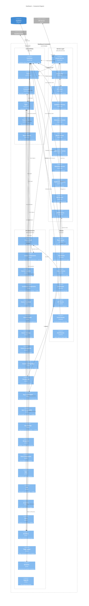

# L3 — Dashboard Components

Derived from AST extraction (depth=5). Components with <3 files and no cross-component dependencies are omitted for clarity.

```mermaid
C4Component
  title Dashboard — Component Diagram

  Container_Boundary(dashboard, "Dashboard (SvelteKit)") {

    Boundary(utils_boundary, "Core Utilities", "lib/utils") {
      Component(utils_functions, "Functions", "TypeScript", "Supabase client, helpers, validators — 47 files")
      Component(utils_store, "Stores", "Svelte Store", "Client-side state: org, user, courses, i18n")
      Component(utils_constants, "Constants", "TypeScript", "App-wide constants and enums")
      Component(utils_types, "Types", "TypeScript", "Shared type definitions")
      Component(utils_translations, "Translations", "sveltekit-i18n", "i18n message catalogs")
      Component(utils_routes, "Route Helpers", "TypeScript", "Public route checks, auth redirects")
    }

    Boundary(services_boundary, "Service Layer", "lib/utils/services") {
      Component(svc_courses, "Course Service", "TypeScript", "Course CRUD and queries")
      Component(svc_org, "Org Service", "TypeScript", "Organization management")
      Component(svc_api, "API Client", "TypeScript", "HTTP client for API service")
      Component(svc_dashboard, "Dashboard Service", "TypeScript", "Dashboard data aggregation")
      Component(svc_attendance, "Attendance Service", "TypeScript", "Attendance tracking")
      Component(svc_marks, "Marks Service", "TypeScript", "Grade/marks management")
      Component(svc_submissions, "Submissions Service", "TypeScript", "Exercise submission handling")
      Component(svc_newsfeed, "Newsfeed Service", "TypeScript", "Community newsfeed")
      Component(svc_notification, "Notification Service", "TypeScript", "Push notifications")
      Component(svc_lms, "LMS Service", "TypeScript", "Student-facing LMS queries")
      Component(svc_middlewares, "Middlewares", "TypeScript", "Auth guards and route protection")
    }

    Boundary(components_boundary, "UI Components", "lib/components") {
      Component(comp_course, "Course Shell", "Svelte", "Course layout, tab navigation, constants")
      Component(comp_course_lesson, "Lesson Components", "Svelte", "Lesson editor, exercises, submissions — 46 files")
      Component(comp_course_analytics, "Course Analytics", "Svelte", "Course-level analytics views")
      Component(comp_course_certificate, "Certificate Components", "Svelte", "Certificate designer and preview — 14 files")
      Component(comp_course_newsfeed, "Course Newsfeed", "Svelte", "Course community feed")
      Component(comp_course_people, "Course People", "Svelte", "Student/teacher roster management")
      Component(comp_course_settings, "Course Settings", "Svelte", "Course configuration panels")
      Component(comp_course_nav, "Course Navigation", "Svelte", "Course internal navigation")
      Component(comp_course_landing, "Course Landing Page", "Svelte", "Public course page and editor — 19 files")
      Component(comp_courses, "Courses List", "Svelte", "Course listing and cards")
      Component(comp_org, "Org Components", "Svelte", "Org settings, community, landing page")
      Component(comp_org_quiz, "Quiz Components", "Svelte", "Quiz builder and player — 18 files")
      Component(comp_org_settings, "Org Settings", "Svelte", "Organization settings panels — 12 files")
      Component(comp_navigation, "Navigation", "Svelte", "Sidebar, header, breadcrumbs")
      Component(comp_form, "Form Components", "Svelte", "Form fields and validation")
      Component(comp_apps, "Apps", "Svelte", "Third-party app integrations")
      Component(comp_apps_poll, "Poll", "Svelte", "Poll creation and voting — 10 files")
      Component(comp_analytics, "Analytics", "Svelte", "Analytics dashboard widgets")
      Component(comp_icons, "Icons", "Svelte", "Custom icon library — 18 files")
      Component(comp_snackbar, "Snackbar", "Svelte", "Toast notifications with store")
      Component(comp_page, "Page Layout", "Svelte", "Page chrome and layout wrappers")
      Component(comp_question, "Question", "Svelte", "Quiz/exercise question rendering")
      Component(comp_upgrade, "Upgrade", "Svelte", "Plan upgrade prompts")
    }

    Boundary(routes_boundary, "Routes", "routes") {
      Component(route_root, "Root Layout", "SvelteKit", "App shell, auth check, i18n init")
      Component(route_org, "Org Routes", "SvelteKit", "Organization management pages")
      Component(route_courses, "Course Routes", "SvelteKit", "Course editor and lesson pages")
      Component(route_lms, "LMS Routes", "SvelteKit", "Student-facing learning views")
      Component(route_api, "API Routes", "SvelteKit", "Server-side API endpoints")
      Component(route_invite, "Invite Routes", "SvelteKit", "Student/teacher invite flows")
      Component(route_auth, "Auth Routes", "SvelteKit", "Login, signup, forgot, reset")
    }
  }

  ContainerDb(db, "Supabase", "Postgres")
  Container_Ext(api_ext, "API Service", "Hono")
  Container_Ext(supabase_auth, "Supabase Auth", "")

  Rel(route_root, utils_store, "Initializes")
  Rel(route_root, svc_middlewares, "Guards routes")
  Rel(route_root, svc_org, "Loads org")
  Rel(route_root, utils_functions, "Supabase + translations")
  Rel(route_org, comp_org, "Renders")
  Rel(route_courses, comp_course, "Renders")
  Rel(route_courses, comp_courses, "Renders")
  Rel(route_lms, svc_lms, "Fetches data")
  Rel(route_api, svc_courses, "Delegates to")
  Rel(route_api, svc_org, "Delegates to")
  Rel(route_invite, utils_functions, "Validates invites")

  Rel(comp_course, comp_course_lesson, "Renders lessons")
  Rel(comp_course, utils_types, "Uses types")
  Rel(comp_course_lesson, svc_courses, "Fetches/updates lessons")
  Rel(comp_course_lesson, comp_question, "Renders exercises")
  Rel(comp_course_lesson, comp_snackbar, "Shows notifications")
  Rel(comp_course_lesson, utils_functions, "Uses helpers")
  Rel(comp_course_lesson, utils_types, "Uses types")
  Rel(comp_course_newsfeed, utils_types, "Uses feed types")
  Rel(comp_course_settings, utils_types, "Uses types")
  Rel(comp_course_landing, utils_functions, "Uses helpers")
  Rel(comp_course_landing, utils_types, "Uses types")
  Rel(comp_courses, utils_functions, "Uses helpers")
  Rel(comp_courses, utils_types, "Uses types")
  Rel(comp_apps_poll, comp_snackbar, "Shows notifications")
  Rel(comp_apps_poll, utils_functions, "Calls Supabase")
  Rel(comp_apps, comp_snackbar, "Shows notifications")
  Rel(comp_apps, utils_functions, "Calls Supabase")

  Rel(svc_courses, utils_functions, "Uses Supabase client")
  Rel(svc_courses, svc_api, "Calls API service")
  Rel(svc_courses, utils_store, "Reads org state")
  Rel(svc_org, utils_functions, "Uses Supabase client")
  Rel(svc_org, utils_store, "Updates org state")
  Rel(svc_dashboard, utils_functions, "Uses Supabase client")
  Rel(svc_newsfeed, utils_functions, "Uses Supabase client")
  Rel(svc_api, api_ext, "HTTP calls", "fetch")
  Rel(utils_functions, db, "Queries", "supabase-js")
  Rel(utils_functions, supabase_auth, "Authenticates", "supabase-js")
  Rel(utils_store, utils_types, "Uses types")
  Rel(utils_constants, utils_types, "Uses types")
  Rel(utils_routes, utils_constants, "Uses route constants")
  Rel(utils_routes, utils_types, "Uses types")
```
