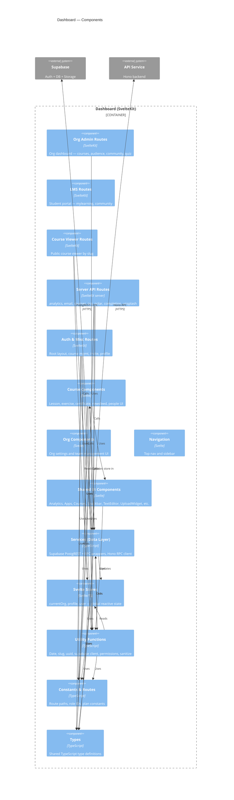

# L3: Dashboard Components

> Derived from AST extraction — do not edit manually.
> Re-generate with `/c4-model diagrams`.

```mermaid
C4Component
  title Dashboard — Components

  Container_Boundary(dashboard, "Dashboard (SvelteKit)") {
    Component(orgRoutes, "Org Admin Routes", "SvelteKit", "Org dashboard — courses, audience, community, quiz")
    Component(lmsRoutes, "LMS Routes", "SvelteKit", "Student portal — mylearning, community")
    Component(courseRoutes, "Course Viewer Routes", "SvelteKit", "Public course viewer by slug")
    Component(apiRoutes, "Server API Routes", "SvelteKit server", "analytics, email, courses, org, polar, completion, unsplash")
    Component(authRoutes, "Auth & Misc Routes", "SvelteKit", "Root layout, course mgmt, invite, profile")

    Component(courseComp, "Course Components", "Svelte", "Lesson, exercise, certificate, newsfeed, people UI")
    Component(orgComp, "Org Components", "Svelte", "Org settings and team management UI")
    Component(navComp, "Navigation", "Svelte", "Top nav and sidebar")
    Component(sharedUI, "Shared UI Components", "Svelte", "Analytics, Apps, Courses, Snackbar, TextEditor, UploadWidget, etc.")

    Component(services, "Services (Data Layer)", "TypeScript", "Supabase PostgREST + RPC wrappers, Hono RPC client")
    Component(stores, "Svelte Stores", "Svelte/TS", "currentOrg, profile, user — global reactive state")
    Component(utils, "Utility Functions", "TypeScript", "Date, slug, uuid, supabase client, permissions, sanitize")
    Component(constants, "Constants & Routes", "TypeScript", "Route paths, role IDs, plan constants")
    Component(types, "Types", "TypeScript", "Shared TypeScript type definitions")
  }

  System_Ext(supabaseExt, "Supabase", "Auth + DB + Storage")
  System_Ext(apiExt, "API Service", "Hono backend")

  Rel(orgRoutes, utils, "Uses")
  Rel(courseRoutes, utils, "Uses")
  Rel(courseRoutes, services, "Calls")
  Rel(apiRoutes, services, "Calls")
  Rel(apiRoutes, utils, "Uses")
  Rel(apiRoutes, constants, "Uses")
  Rel(apiRoutes, types, "Uses")
  Rel(authRoutes, services, "Calls")
  Rel(authRoutes, utils, "Uses")
  Rel(authRoutes, constants, "Uses")
  Rel(authRoutes, stores, "Reads")
  Rel(authRoutes, types, "Uses")
  Rel(courseComp, services, "Calls")
  Rel(courseComp, utils, "Uses")
  Rel(courseComp, constants, "Uses")
  Rel(courseComp, types, "Uses")
  Rel(courseComp, sharedUI, "Uses")
  Rel(services, stores, "Updates")
  Rel(services, utils, "Uses")
  Rel(services, constants, "Uses")
  Rel(services, types, "Uses")
  Rel(services, courseComp, "Updates store in")
  Rel(services, supabaseExt, "PostgREST / RPC", "HTTPS")
  Rel(services, apiExt, "Hono RPC", "HTTPS")
  Rel(stores, constants, "Uses")
  Rel(stores, types, "Uses")
  Rel(utils, services, "Calls")
  Rel(utils, stores, "Reads")
  Rel(utils, constants, "Uses")
  Rel(sharedUI, utils, "Uses")
```
