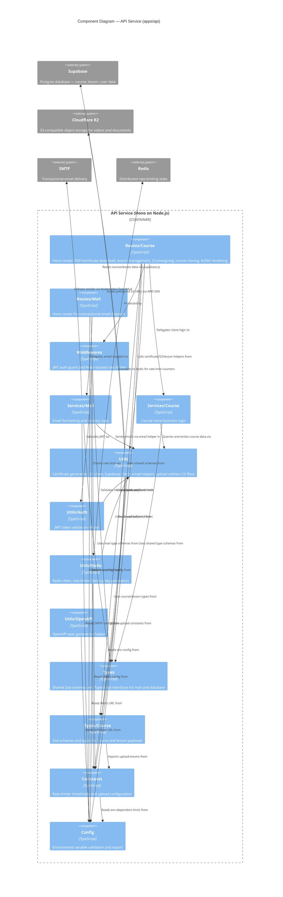

# C4 Layer 3 — API Service Components
_Auto-derived from AST extraction. Re-generate with `/c4-model`._

```mermaid
C4Component
  title Component Diagram — API Service (apps/api)
  UpdateLayoutConfig($c4ShapeInRow="4", $c4BoundaryInRow="1")

  Container_Boundary(api_boundary, "API Service (Hono on Node.js)") {
    Component(routes_course, "Routes/Course", "TypeScript", "Hono router: PDF/certificate download, lesson management, S3 presigning, course cloning, KaTeX rendering")
    Component(routes, "Routes/Mail", "TypeScript", "Hono router for transactional email dispatch")
    Component(middlewares, "Middlewares", "TypeScript", "JWT auth guard and Redis-backed rate limiter")
    Component(services, "Services/Mail", "TypeScript", "Email formatting and delivery logic")
    Component(services_course, "Services/Course", "TypeScript", "Course clone business logic")
    Component(utils, "Utils", "TypeScript", "Certificate generation, S3 client, Supabase client, email helpers, upload utilities (10 files)")
    Component(utils_auth, "Utils/Auth", "TypeScript", "JWT token validation helper")
    Component(utils_redis, "Utils/Redis", "TypeScript", "Redis client, rate-limiter factory, key generators")
    Component(utils_openapi, "Utils/OpenAPI", "TypeScript", "OpenAPI spec generation helper")
    Component(types, "Types", "TypeScript", "Shared Zod schemas and TypeScript interfaces for mail and database")
    Component(types_course, "Types/Course", "TypeScript", "Zod schemas and types for course and lesson payloads")
    Component(constants, "Constants", "TypeScript", "Rate-limiter thresholds and upload configuration")
    Component(config, "Config", "TypeScript", "Environment variable validation and export")
  }

  System_Ext(supabase, "Supabase", "Postgres database — course, lesson, user data")
  System_Ext(s3, "Cloudflare R2", "S3-compatible object storage for videos and documents")
  System_Ext(smtp, "SMTP", "Transactional email delivery")
  System_Ext(redis_ext, "Redis", "Distributed rate-limiting state")

  Rel(routes_course, types_course, "Validates payloads with")
  Rel(routes_course, services_course, "Delegates clone logic to")
  Rel(routes_course, middlewares, "Protected by")
  Rel(routes_course, types, "Uses shared schemas from")
  Rel(routes_course, utils, "Calls certificate/S3/lesson helpers from")
  Rel(routes_course, constants, "Reads upload limits from")

  Rel(routes, services, "Delegates email dispatch to")
  Rel(routes, types, "Validates mail payloads with")
  Rel(routes, config, "Reads env config from")

  Rel(middlewares, utils_auth, "Validates JWT via")
  Rel(middlewares, constants, "Reads rate-limit config from")
  Rel(middlewares, utils_redis, "Checks rate limit via")

  Rel(services, utils, "Sends emails via email helper in")
  Rel(services, types, "Uses mail type schemas from")
  Rel(services, config, "Reads SMTP config from")

  Rel(services_course, utils, "Queries and writes course data via")
  Rel(services_course, types, "Uses shared type schemas from")

  Rel(utils, types_course, "Uses course/lesson types from")
  Rel(utils, constants, "Reads upload constants from")
  Rel(utils, config, "Reads env config from")

  Rel(utils_auth, utils, "Uses Supabase client from")
  Rel(utils_redis, utils, "Uses shared helpers from")
  Rel(utils_redis, constants, "Reads Redis config from")
  Rel(utils_redis, config, "Reads Redis URL from")

  Rel(types_course, constants, "Imports upload enums from")
  Rel(utils_openapi, config, "Reads API base URL from")
  Rel(constants, config, "Reads env-dependent limits from")

  Rel(utils, supabase, "Reads course/lesson data via supabase-js")
  Rel(utils, s3, "Issues presigned S3 URLs via AWS SDK")
  Rel(services, smtp, "Delivers emails via Nodemailer/ZeptoMail")
  Rel(utils_redis, redis_ext, "Connects to Redis for rate-limit counters")
```
