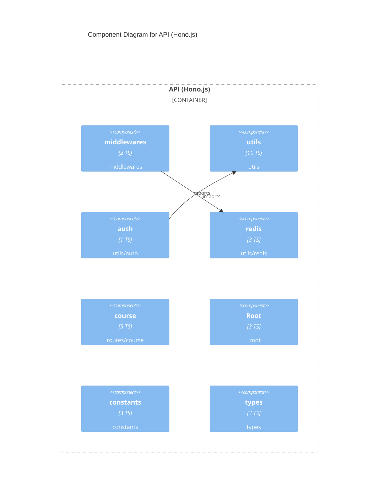

# C4 Level 3 — Components: API (Hono.js)

_Extracted 2026-05-15 · depth=2_

## Component Inventory

| Component | TS | Svelte | Path |
|-----------|----:|-------:|------|
| Root | 3 | 0 | `_root` |
| config | 1 | 0 | `config` |
| constants | 3 | 0 | `constants` |
| middlewares | 2 | 0 | `middlewares` |
| routes | 1 | 0 | `routes` |
| course | 5 | 0 | `routes/course` |
| services | 1 | 0 | `services` |
| course | 1 | 0 | `services/course` |
| types | 3 | 0 | `types` |
| course | 2 | 0 | `types/course` |
| utils | 10 | 0 | `utils` |
| auth | 1 | 0 | `utils/auth` |
| openapi | 1 | 0 | `utils/openapi` |
| redis | 3 | 0 | `utils/redis` |
