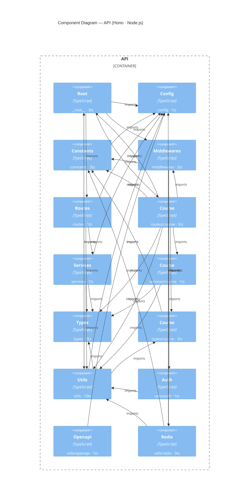

# C4 Layer 3 — API Components

> AST-extracted. Re-run `generate-c4.ts` after structural changes.

**Depth:** 2 · **Components:** 14 · **Relationships:** 34

```mermaid
C4Component
title Component Diagram — API (Hono · Node.js)

Container_Boundary(api_b, "API") {
  Component(api___root__, "Root", "TypeScript", "__root__ · 3ts")
  Component(api_config, "Config", "TypeScript", "config · 1ts")
  Component(api_constants, "Constants", "TypeScript", "constants · 3ts")
  Component(api_middlewares, "Middlewares", "TypeScript", "middlewares · 2ts")
  Component(api_routes, "Routes", "TypeScript", "routes · 1ts")
  Component(api_routes_course, "Course", "TypeScript", "routes/course · 5ts")
  Component(api_services, "Services", "TypeScript", "services · 1ts")
  Component(api_services_course, "Course", "TypeScript", "services/course · 1ts")
  Component(api_types, "Types", "TypeScript", "types · 3ts")
  Component(api_types_course, "Course", "TypeScript", "types/course · 2ts")
  Component(api_utils, "Utils", "TypeScript", "utils · 10ts")
  Component(api_utils_auth, "Auth", "TypeScript", "utils/auth · 1ts")
  Component(api_utils_openapi, "Openapi", "TypeScript", "utils/openapi · 1ts")
  Component(api_utils_redis, "Redis", "TypeScript", "utils/redis · 3ts")
}

Rel(api___root__, api_config, "imports")
Rel(api___root__, api_middlewares, "imports")
Rel(api___root__, api_routes, "imports")
Rel(api___root__, api_routes_course, "imports")
Rel(api___root__, api_utils, "imports")
Rel(api_constants, api_config, "imports")
Rel(api_middlewares, api_constants, "imports")
Rel(api_middlewares, api_utils_auth, "imports")
Rel(api_middlewares, api_utils_redis, "imports")
Rel(api_routes_course, api___root__, "imports")
Rel(api_routes_course, api_constants, "imports")
Rel(api_routes_course, api_middlewares, "imports")
Rel(api_routes_course, api_services_course, "imports")
Rel(api_routes_course, api_types, "imports")
Rel(api_routes_course, api_types_course, "imports")
Rel(api_routes_course, api_utils, "imports")
Rel(api_routes, api_config, "imports")
Rel(api_routes, api_services, "imports")
Rel(api_routes, api_types, "imports")
Rel(api_services_course, api_types, "imports")
Rel(api_services_course, api_utils, "imports")
Rel(api_services, api_config, "imports")
Rel(api_services, api_types, "imports")
Rel(api_services, api_utils, "imports")
Rel(api_types_course, api_constants, "imports")
Rel(api_utils, api___root__, "imports")
Rel(api_utils_auth, api_utils, "imports")
Rel(api_utils_openapi, api_config, "imports")
Rel(api_utils_redis, api_config, "imports")
Rel(api_utils_redis, api_constants, "imports")
Rel(api_utils_redis, api_utils, "imports")
Rel(api_utils, api_config, "imports")
Rel(api_utils, api_types, "imports")
Rel(api_utils, api_types_course, "imports")
```
