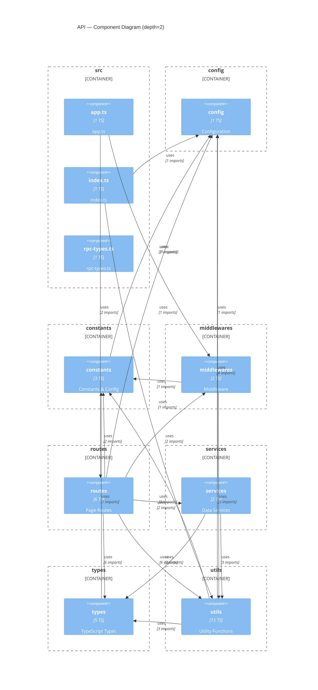

# Layer 3 — API Components

_Generated 2026-03-13 from AST extraction. Re-run `extract.ts` + `generate-diagrams.ts` to update._

## Components

| Key | TS files | Svelte files | Description |
|-----|----------|--------------|-------------|
| `src/app.ts` | 1 | 0 | app.ts |
| `src/config` | 1 | 0 | Configuration |
| `src/constants` | 3 | 0 | Constants & Config |
| `src/index.ts` | 1 | 0 | index.ts |
| `src/middlewares` | 2 | 0 | Middleware |
| `src/routes` | 6 | 0 | Page Routes |
| `src/rpc-types.ts` | 1 | 0 | rpc-types.ts |
| `src/services` | 2 | 0 | Data Services |
| `src/types` | 5 | 0 | TypeScript Types |
| `src/utils` | 15 | 0 | Utility Functions |

## Top External Dependencies

| Package | Import count |
|---------|-------------|
| `hono` | 19 |
| `zod` | 5 |
| `@hono/zod-validator` | 4 |
| `@supabase/supabase-js` | 4 |
| `nodemailer` | 3 |
| `dotenv` | 2 |
| `marked` | 2 |
| `@aws-sdk/client-s3` | 2 |
| `@aws-sdk/s3-request-presigner` | 2 |
| `ioredis` | 2 |