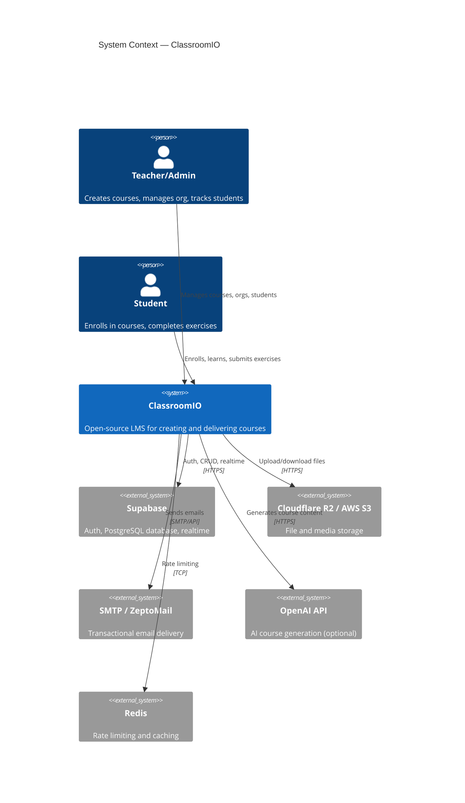

# C4 Layer 1 — System Context

ClassroomIO is an open-source LMS platform. Teachers create and manage courses; students enroll and learn. The system depends on Supabase (auth + DB), object storage (S3/R2), email delivery (SMTP), and optionally OpenAI for AI-assisted course generation.

