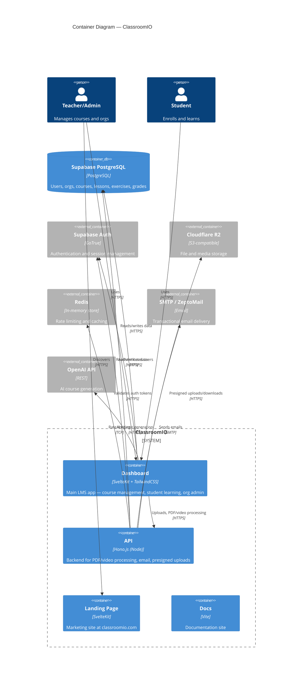

# C4 Layer 2 — Container

ClassroomIO is a monorepo with four deployable containers. The Dashboard is the main SvelteKit app serving both teacher and student UIs. The API handles backend processing (PDF, video, email, uploads). Both talk to Supabase directly. The Landing Page and Docs are static marketing/documentation sites.

