# C4 Layer 3 — API Components

The API (Hono.js) handles backend processing: course cloning, lesson rendering, presigned S3 uploads, and email sending. 16 components and 34 relationships extracted from `apps/api/src/`.

```mermaid
C4Component
    title Component Diagram — API (Hono.js)

    Container_Boundary(api, "API Container") {
        Component(app, "App", "Hono.js", "Main app setup, mounts route handlers")
        Component(index, "Index", "Node", "Server entrypoint, starts HTTP listener")
        Component(rpc_types, "RPC Types", "TypeScript", "Typed RPC client exports")

        Boundary(routes_b, "Routes") {
            Component(routes_course, "Course Routes", "Hono", "Clone, lesson, katex, presign endpoints (5 files)")
            Component(routes_mail, "Mail Route", "Hono", "Email sending endpoint")
        }

        Boundary(services_b, "Services") {
            Component(services_course, "Course Service", "TypeScript", "Course cloning business logic")
            Component(services_mail, "Mail Service", "TypeScript", "Email composition and sending")
        }

        Boundary(middleware_b, "Middleware") {
            Component(middlewares, "Middleware", "Hono", "Auth validation, rate limiting (2 files)")
        }

        Boundary(utils_b, "Utilities") {
            Component(utils, "Utils", "TypeScript", "Supabase, S3, Cloudflare, email, certificate (10 files)")
            Component(utils_auth, "Auth Utils", "TypeScript", "User validation")
            Component(utils_redis, "Redis Utils", "TypeScript", "Redis client, rate limiter, key generators (3 files)")
            Component(utils_openapi, "OpenAPI Utils", "TypeScript", "API spec generation")
        }

        Boundary(types_b, "Types") {
            Component(types, "Types", "TypeScript", "Database, mail type definitions (3 files)")
            Component(types_course, "Course Types", "TypeScript", "Course and lesson type defs (2 files)")
        }

        Component(config, "Config", "TypeScript", "Environment variable loading")
        Component(constants, "Constants", "TypeScript", "Rate limiter, upload constants (3 files)")
    }

    ContainerDb_Ext(supabase, "Supabase DB", "PostgreSQL")
    Container_Ext(storage, "Cloudflare R2", "S3-compatible")
    Container_Ext(redis, "Redis", "Rate limiting")
    Container_Ext(smtp, "SMTP", "Email")

    Rel(index, app, "Creates and starts")
    Rel(index, utils_openapi, "Generates API spec")
    Rel(index, config, "Reads config")
    Rel(rpc_types, app, "Exports typed routes")
    Rel(app, routes_course, "Mounts /course/*")
    Rel(app, routes_mail, "Mounts /mail/*")
    Rel(app, middlewares, "Applies middleware")
    Rel(routes_course, utils, "Uses helpers")
    Rel(routes_course, types_course, "Uses types")
    Rel(routes_course, middlewares, "Auth + rate limit")
    Rel(routes_course, constants, "Upload constants")
    Rel(routes_course, services_course, "Delegates logic")
    Rel(routes_course, types, "Uses types")
    Rel(routes_mail, services_mail, "Delegates email")
    Rel(routes_mail, types, "Uses mail types")
    Rel(routes_mail, config, "Reads config")
    Rel(services_mail, utils, "Uses email utils")
    Rel(services_mail, types, "Uses types")
    Rel(services_mail, config, "Reads config")
    Rel(services_course, utils, "Uses Supabase, S3")
    Rel(services_course, types, "Uses types")
    Rel(middlewares, utils_redis, "Rate limiting")
    Rel(middlewares, utils_auth, "User validation")
    Rel(middlewares, constants, "Rate limit constants")
    Rel(utils, config, "Reads env vars")
    Rel(utils, constants, "Uses constants")
    Rel(utils, types_course, "Uses course types")
    Rel(utils_auth, utils, "Uses Supabase client")
    Rel(utils_redis, utils, "Uses helpers")
    Rel(utils_redis, constants, "Key patterns")
    Rel(utils_redis, config, "Redis connection config")
    Rel(utils_openapi, config, "Reads config")
    Rel(constants, config, "Reads env vars")
    Rel(types_course, constants, "Uses constants")

    Rel(utils, supabase, "CRUD operations")
    Rel(utils, storage, "Presigned URLs")
    Rel(utils_redis, redis, "Rate limit state")
    Rel(services_mail, smtp, "Sends email")
```

