# C4 Layer 3 — Dashboard Components

The Dashboard (SvelteKit) is the main LMS app for teachers and students. 173 components and 120 relationships extracted from `apps/dashboard/src/`. Components grouped by feature area; Svelte file counts noted where significant.

## Core Architecture Components

```mermaid
C4Component
    title Component Diagram — Dashboard Core (SvelteKit)

    Container_Boundary(dashboard, "Dashboard Container") {

        Boundary(state_b, "State & Data Layer") {
            Component(store, "Stores", "Svelte Stores", "Org, user, app state (5 files)")
            Component(types, "Types", "TypeScript", "Shared type definitions (9 files)")
            Component(constants, "Constants", "TypeScript", "App-wide constants (9 files)")
            Component(config, "Config", "TypeScript", "Supabase URL, keys, env config")
        }

        Boundary(services_b, "Services Layer (21 files)") {
            Component(svc_courses, "Course Service", "TypeScript", "Course CRUD, enrollment")
            Component(svc_org, "Org Service", "TypeScript", "Org management, members, invites")
            Component(svc_exercise, "Exercise Service", "TypeScript", "Exercise submission, grading")
            Component(svc_community, "Community Service", "TypeScript", "Q&A, discussions, comments")
            Component(svc_attendance, "Attendance Service", "TypeScript", "Lesson attendance tracking")
            Component(svc_newsfeed, "Newsfeed Service", "TypeScript", "Course newsfeed posts")
            Component(svc_presign, "Presign Service", "TypeScript", "File upload via API presigned URLs")
            Component(svc_posthog, "PostHog Service", "TypeScript", "Analytics event tracking")
            Component(svc_domain, "Domain Service", "TypeScript", "Custom domain management")
            Component(svc_certificate, "Certificate Service", "TypeScript", "Certificate generation")
            Component(svc_editor, "Editor Service", "TypeScript", "Text editor utilities")
            Component(svc_lesson, "Lesson Service", "TypeScript", "Lesson CRUD operations")
            Component(svc_completion, "Completion Service", "TypeScript", "Course completion tracking")
        }

        Boundary(functions_b, "Functions Layer (52 files)") {
            Component(fn_core, "Core Functions", "TypeScript", "Supabase client, helpers (47 files)")
            Component(fn_routes, "Route Functions", "TypeScript", "Route generation, navigation utils")
            Component(fn_translations, "Translations", "sveltekit-i18n", "i18n with ICU parser")
        }
    }

    ContainerDb_Ext(supabase, "Supabase", "PostgreSQL + Auth")
    Container_Ext(api, "API Container", "Hono.js")
    Container_Ext(posthog, "PostHog", "Analytics")

    Rel(fn_core, store, "Reads/writes state")
    Rel(fn_core, constants, "Uses constants")
    Rel(fn_core, config, "Reads config")
    Rel(fn_core, types, "Uses types")
    Rel(fn_core, svc_posthog, "Tracks events")
    Rel(fn_core, fn_routes, "Generates routes")
    Rel(fn_core, svc_courses, "Service calls")
    Rel(fn_core, store, "Reads/writes state")

    Rel(store, types, "Typed state")
    Rel(store, constants, "Default values")

    Rel(svc_courses, types, "Uses types")
    Rel(svc_courses, fn_core, "Supabase calls")
    Rel(svc_org, types, "Uses types")
    Rel(svc_org, store, "Reads org state")
    Rel(svc_newsfeed, types, "Uses types")
    Rel(svc_presign, fn_core, "API calls")
    Rel(svc_community, types, "Uses types")

    Rel(fn_core, supabase, "Auth + CRUD", "HTTPS")
    Rel(svc_presign, api, "Presigned uploads", "HTTPS")
    Rel(svc_posthog, posthog, "Events", "HTTPS")
```

## UI Components

```mermaid
C4Component
    title Component Diagram — Dashboard UI (SvelteKit)

    Container_Boundary(ui, "Dashboard UI Layer") {

        Boundary(course_b, "Course Components (120+ files)") {
            Component(course_main, "Course Manager", "Svelte", "Course management: lessons, exercises, settings (91 files, 68 Svelte)")
            Component(course_landing, "Course Landing Page", "Svelte", "Public course page (19 files, 15 Svelte)")
            Component(course_container, "Course Container", "Svelte", "Course layout wrapper")
            Component(courses_list, "Courses List", "Svelte", "Course listing and filtering (10 files, 7 Svelte)")
        }

        Boundary(org_b, "Org Components (46 files, 44 Svelte)") {
            Component(org_settings, "Org Settings", "Svelte", "Org config: billing, branding, members")
            Component(org_community, "Org Community", "Svelte", "Community forums and Q&A")
            Component(org_audience, "Org Audience", "Svelte", "Student management")
            Component(org_apps, "Org Apps", "Svelte", "App integrations (poll, comments)")
            Component(org_landingpage, "Org Landing Page", "Svelte", "Org public page editor")
        }

        Boundary(lms_b, "LMS Components") {
            Component(lms_learning, "My Learning", "Svelte", "Student course dashboard")
            Component(lms_community, "LMS Community", "Svelte", "Student community view (4 files)")
            Component(lms_exercises, "Exercises", "Svelte", "Exercise submission UI")
            Component(lms_explore, "Explore", "Svelte", "Course discovery")
            Component(lms_settings, "LMS Settings", "Svelte", "Student profile settings")
        }

        Boundary(apps_b, "Apps Components (15 files, 9 Svelte)") {
            Component(apps_poll, "Poll App", "Svelte", "Polls: create, vote, results (12 files)")
        }

        Boundary(shared_b, "Shared UI Components") {
            Component(navigation, "Navigation", "Svelte", "Sidebar, header, breadcrumbs (8 files)")
            Component(form, "Form Components", "Svelte", "Input, select, checkbox, etc. (8 files)")
            Component(question, "Question Components", "Svelte", "Quiz question types (7 files)")
            Component(text_editor, "Text Editor", "Svelte", "Rich text / markdown editor")
            Component(icons, "Icons", "Svelte", "Icon library (18 files)")
            Component(page, "Page Components", "Svelte", "Page layout primitives (6 files)")
            Component(analytics_ui, "Analytics", "Svelte", "Charts and data viz (4 files)")
        }

        Boundary(routes_b, "SvelteKit Routes") {
            Component(routes_org, "Org Routes", "SvelteKit", "/org/[slug]/* — teacher admin (22 files)")
            Component(routes_lms, "LMS Routes", "SvelteKit", "/lms/* — student views")
            Component(routes_courses, "Course Routes", "SvelteKit", "/courses/[id]/* (27 files)")
            Component(routes_api, "API Routes", "SvelteKit", "Server-side endpoints: email, courses, analytics (33 files)")
            Component(routes_auth, "Auth Routes", "SvelteKit", "Login, signup, onboarding, reset, verify")
        }
    }

    Container_Ext(core, "Dashboard Core", "State + Services + Functions")
    Container_Ext(mail, "Mail Templates", "TypeScript", "Email template rendering")

    Rel(routes_org, org_settings, "Renders")
    Rel(routes_org, org_community, "Renders")
    Rel(routes_org, org_audience, "Renders")
    Rel(routes_courses, course_main, "Renders")
    Rel(routes_courses, course_landing, "Renders")
    Rel(routes_lms, lms_learning, "Renders")
    Rel(routes_lms, lms_community, "Renders")
    Rel(routes_lms, lms_exercises, "Renders")
    Rel(routes_lms, lms_explore, "Renders")

    Rel(course_main, core, "Uses services, stores, functions")
    Rel(org_settings, core, "Uses services, stores")
    Rel(routes_api, core, "Server-side data operations")
    Rel(routes_api, mail, "Email templates")
    Rel(routes_auth, core, "Auth flows")
    Rel(apps_poll, core, "Poll data operations")
    Rel(courses_list, core, "Fetches course lists")
```

