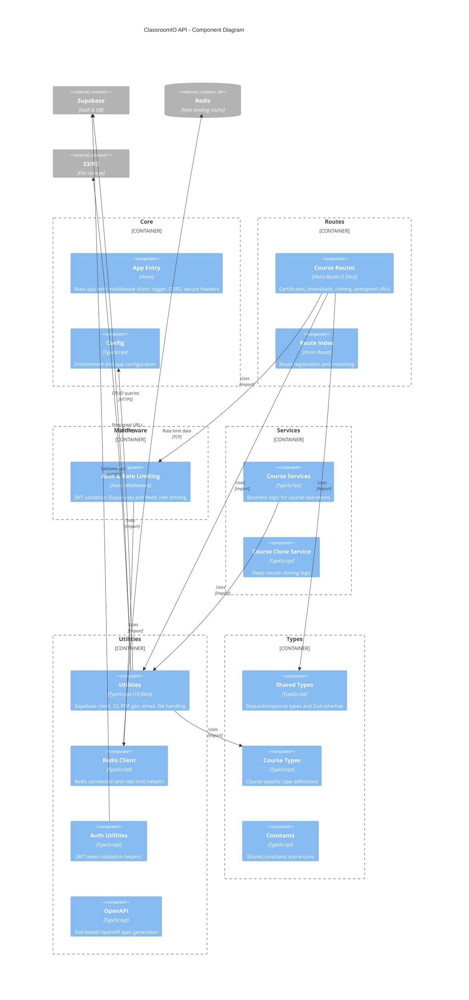

# C4 Layer 3: API Components — ClassroomIO

Shows the internal component structure of the API container (Hono/Node.js).

```mermaid
C4Component
    title ClassroomIO API - Component Diagram

    Container_Boundary(core-boundary, "Core") {
        Component(app-entry, "App Entry", "Hono", "Main app with middleware chain: logger, CORS, secure headers")
        Component(config, "Config", "TypeScript", "Environment and app configuration")
    }

    Container_Boundary(routes-boundary, "Routes") {
        Component(course-routes, "Course Routes", "Hono Route (5 files)", "Certificates, downloads, cloning, presigned URLs")
        Component(routes-index, "Route Index", "Hono Route", "Route registration and mounting")
    }

    Container_Boundary(middleware-boundary, "Middleware") {
        Component(middlewares, "Auth & Rate Limiting", "Hono Middleware", "JWT validation (Supabase) and Redis rate limiting")
    }

    Container_Boundary(services-boundary, "Services") {
        Component(services, "Course Services", "TypeScript", "Business logic for course operations")
        Component(services-course, "Course Clone Service", "TypeScript", "Deep course cloning logic")
    }

    Container_Boundary(utils-boundary, "Utilities") {
        Component(utils, "Utilities", "TypeScript (10 files)", "Supabase client, S3, PDF gen, email, file handling")
        Component(utils-redis, "Redis Client", "TypeScript", "Redis connection and rate limit helpers")
        Component(utils-auth, "Auth Utilities", "TypeScript", "JWT token validation helpers")
        Component(utils-openapi, "OpenAPI", "TypeScript", "Zod-based OpenAPI spec generation")
    }

    Container_Boundary(types-boundary, "Types") {
        Component(types, "Shared Types", "TypeScript", "Request/response types and Zod schemas")
        Component(types-course, "Course Types", "TypeScript", "Course-specific type definitions")
        Component(constants, "Constants", "TypeScript", "Shared constants and enums")
    }

    Rel(course-routes, utils, "Uses", "Import")
    Rel(course-routes, types, "Uses", "Import")
    Rel(course-routes, middlewares, "Uses", "Import")
    Rel(middlewares, utils-redis, "Uses", "Import")
    Rel(services, utils, "Uses", "Import")
    Rel(utils, types-course, "Uses", "Import")
    Rel(utils, config, "Uses", "Import")

    Container_Ext(supabase, "Supabase", "Auth & DB")
    ContainerDb_Ext(redis-ext, "Redis", "Rate limiting cache")
    Container_Ext(s3-r2, "S3/R2", "File storage")

    Rel(utils, supabase, "CRUD queries", "HTTPS")
    Rel(utils-redis, redis-ext, "Rate limit data", "TCP")
    Rel(utils, s3-r2, "Presigned URLs", "HTTPS")
    Rel(utils-auth, supabase, "Validates JWT", "HTTPS")
```

---
*Generated on 2026-03-13*
