# C4 Level 3 — Components: API (Hono/Node.js)

```mermaid
C4Component
  title Component diagram — API (Hono/Node.js)

  Container_Boundary(c_api, "API (Hono/Node.js)") {
    Component(api_root, "Root [3 ts]", "TypeScript / Hono", "App entry point (index.ts) and Hono app factory (app.ts)")
    Component(api_config, "Config [1 ts]", "TypeScript / Hono", "Zod-validated environment variables")
    Component(api_constants, "Constants [3 ts]", "TypeScript / Hono", "Shared constants — rate limits, upload limits")
    Component(api_middlewares, "Middlewares [2 ts]", "TypeScript / Hono", "Hono middleware — JWT auth, Redis rate limiting")
    Component(api_routes, "Routes [1 ts]", "TypeScript / Hono", "Routes")
    Component(api_routes_course, "Course [5 ts]", "TypeScript / Hono", "Hono handlers — PDF download, cert, lesson, clone, presign, KaTeX")
    Component(api_services, "Services [1 ts]", "TypeScript / Hono", "Services")
    Component(api_services_course, "Course [1 ts]", "TypeScript / Hono", "Course clone business logic")
    Component(api_types, "Types [3 ts]", "TypeScript / Hono", "Shared TypeScript type definitions")
    Component(api_types_course, "Course [2 ts]", "TypeScript / Hono", "Course")
    Component(api_utils, "Utils [10 ts]", "TypeScript / Hono", "PDF gen, certificate, S3 upload, Supabase client, email, lesson utils")
    Component(api_utils_auth, "Auth [1 ts]", "TypeScript / Hono", "JWT token validation")
    Component(api_utils_openapi, "Openapi [1 ts]", "TypeScript / Hono", "OpenAPI spec generation (Scalar)")
    Component(api_utils_redis, "Redis [3 ts]", "TypeScript / Hono", "Redis client + rate-limit key generators")
  }

  System_Ext(ext_redis, "Redis", "In-memory store")
  System_Ext(ext_r2, "Cloudflare R2", "S3-compatible object storage")
  System_Ext(ext_smtp, "ZeptoMail / SMTP", "Email")
  System_Ext(ext_supabase, "Supabase", "PostgreSQL + Auth")

  Rel(api_root, api_config, "uses")
  Rel(api_root, api_middlewares, "uses")
  Rel(api_root, api_routes, "uses")
  Rel(api_root, api_routes_course, "uses")
  Rel(api_root, api_utils, "uses")
  Rel(api_constants, api_config, "uses")
  Rel(api_middlewares, api_constants, "uses")
  Rel(api_middlewares, api_utils_auth, "uses")
  Rel(api_middlewares, api_utils_redis, "uses")
  Rel(api_routes, api_config, "uses")
  Rel(api_routes, api_services, "uses")
  Rel(api_routes, api_types, "uses")
  Rel(api_routes_course, api_root, "uses")
  Rel(api_routes_course, api_constants, "uses")
  Rel(api_routes_course, api_middlewares, "uses")
  Rel(api_routes_course, api_services_course, "uses")
  Rel(api_routes_course, api_types, "uses")
  Rel(api_routes_course, api_types_course, "uses")
  Rel(api_routes_course, api_utils, "uses")
  Rel(api_services, api_config, "uses")
  Rel(api_services, api_types, "uses")
  Rel(api_services, api_utils, "uses")
  Rel(api_services_course, api_types, "uses")
  Rel(api_services_course, api_utils, "uses")
  Rel(api_types_course, api_constants, "uses")
  Rel(api_utils, api_root, "uses")
  Rel(api_utils, api_config, "uses")
  Rel(api_utils, api_types, "uses")
  Rel(api_utils, api_types_course, "uses")
  Rel(api_utils_auth, api_utils, "uses")
  Rel(api_utils_openapi, api_config, "uses")
  Rel(api_utils_redis, api_config, "uses")
  Rel(api_utils_redis, api_constants, "uses")
  Rel(api_utils_redis, api_utils, "uses")

  Rel(api_routes_course, ext_supabase, "uses")
  Rel(api_routes_course, ext_r2, "uses")
  Rel(api_services, ext_smtp, "uses")
  Rel(api_services_course, ext_supabase, "uses")
  Rel(api_utils, ext_smtp, "uses")
  Rel(api_utils, ext_r2, "uses")
  Rel(api_utils, ext_supabase, "uses")
  Rel(api_utils_auth, ext_supabase, "uses")
  Rel(api_utils_redis, ext_redis, "uses")

  UpdateLayoutConfig($c4ShapeInRow="4", $c4BoundaryInRow="1")
```

## Component Summary

| Component | TS files | Svelte | Key externals |
|-----------|----------|--------|---------------|
| `_root` | 3 | 0 | — |
| `config` | 1 | 0 | — |
| `constants` | 3 | 0 | — |
| `middlewares` | 2 | 0 | — |
| `routes` | 1 | 0 | — |
| `routes/course` | 5 | 0 | Supabase, Cloudflare R2 |
| `services` | 1 | 0 | ZeptoMail / SMTP |
| `services/course` | 1 | 0 | Supabase |
| `types` | 3 | 0 | — |
| `types/course` | 2 | 0 | — |
| `utils` | 10 | 0 | ZeptoMail / SMTP, Cloudflare R2, Supabase |
| `utils/auth` | 1 | 0 | Supabase |
| `utils/openapi` | 1 | 0 | — |
| `utils/redis` | 3 | 0 | Redis |

*Extracted 2026-05-15 — depth 2*