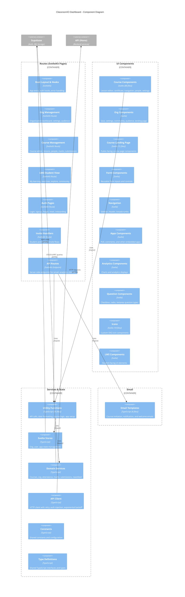

# C4 Layer 3: Dashboard Components — ClassroomIO

Shows the internal component structure of the Dashboard container (SvelteKit).

```mermaid
C4Component
    title ClassroomIO Dashboard - Component Diagram

    Container_Boundary(routes-boundary, "Routes (SvelteKit Pages)") {
        Component(routes-root, "Root Layout & Hooks", "SvelteKit", "App entry, auth hooks, error handling")
        Component(routes-org, "Org Management", "SvelteKit Route", "Organization dashboard, settings, audience")
        Component(routes-courses, "Course Management", "SvelteKit Route", "Course editor, lessons, people, marks, submissions")
        Component(routes-lms, "LMS Student View", "SvelteKit Route", "My learning, exercises, explore, community")
        Component(routes-auth, "Auth Pages", "SvelteKit Route", "Login, signup, forgot, reset, onboarding")
        Component(routes-invite, "Invite Handlers", "SvelteKit Route", "Student and teacher invite flows")
        Component(routes-api, "API Routes", "SvelteKit Endpoint", "Server-side endpoints for email, analytics, courses")
    }

    Container_Boundary(components-boundary, "UI Components") {
        Component(course-components, "Course Components", "Svelte (88 files)", "Lesson editor, certificate, navigation, people, settings")
        Component(org-components, "Org Components", "Svelte", "Quiz, settings, community, audience, landing page")
        Component(landing-page, "Course Landing Page", "Svelte (15 files)", "Public-facing course page components")
        Component(form-components, "Form Components", "Svelte", "Reusable form inputs and controls")
        Component(navigation, "Navigation", "Svelte", "Sidebar, header, breadcrumbs")
        Component(apps-components, "Apps Components", "Svelte", "Poll, comments, and other embedded apps")
        Component(analytics, "Analytics Components", "Svelte", "Charts and analytics displays")
        Component(question, "Question Components", "Svelte", "Checkbox, radio, textarea question types")
        Component(icons, "Icons", "Svelte (18 files)", "Custom SVG icon components")
        Component(lms-components, "LMS Components", "Svelte", "Student-facing UI elements")
    }

    Container_Boundary(services-boundary, "Services & State") {
        Component(utils-functions, "Utility Functions", "TypeScript (39 files)", "API calls, date formatting, course logic, app setup")
        Component(utils-store, "Svelte Stores", "TypeScript", "Org, user, app state management")
        Component(utils-services, "Domain Services", "TypeScript", "Courses, org, attendance, marks, submissions, newsfeed")
        Component(utils-api, "API Client", "TypeScript", "HTTP client with retry, auth injection, exponential backoff")
        Component(utils-constants, "Constants", "TypeScript", "Shared constants and configuration")
        Component(utils-types, "Type Definitions", "TypeScript", "Shared TypeScript interfaces and types")
    }

    Container_Boundary(email-boundary, "Email") {
        Component(email-templates, "Email Templates", "TypeScript (8 files)", "Course invitation, notification, and welcome emails")
    }

    Rel(routes-api, email-templates, "Uses", "Import")
    Rel(course-components, utils-functions, "Uses", "Import")
    Rel(utils-functions, utils-services, "Uses", "Import")
    Rel(utils-functions, utils-store, "Uses", "Import")
    Rel(routes-api, utils-functions, "Uses", "Import")

    Container_Ext(supabase, "Supabase", "Auth, DB, Storage")
    Container_Ext(api, "API (Hono)", "Backend services")

    Rel(utils-services, supabase, "CRUD & RPC queries", "HTTPS")
    Rel(utils-api, api, "HTTP requests", "HTTPS")
    Rel(utils-store, supabase, "Auth state", "HTTPS")
```

---
*Generated on 2026-03-13*
