# C4 Level 3 — Components: Dashboard (SvelteKit)

```mermaid
C4Component
  title Component diagram — Dashboard (SvelteKit)

  Container_Boundary(c_dashboard, "Dashboard (SvelteKit)") {
    Component(dashboard_mocks_app, "$App [1 ts]", "TypeScript", "$App")
    Component(dashboard_root, "Root [2 ts]", "TypeScript", "SvelteKit root layout and top-level hooks")
    Component(dashboard_lib, "Lib [1 ts]", "TypeScript", "Lib")
    Component(dashboard_lib_components, "Components [49 ts, 242 svelte]", "TypeScript", "Shared UI components (root)")
    Component(dashboard_lib_mocks, "Mocks [2 ts]", "TypeScript", "Mocks")
    Component(dashboard_lib_mocks_css, "Css [21 ts]", "TypeScript", "Css")
    Component(dashboard_lib_mocks_git, "Git [21 ts]", "TypeScript", "Git")
    Component(dashboard_lib_mocks_html, "Html [21 ts]", "TypeScript", "Html")
    Component(dashboard_lib_mocks_js, "Js [21 ts]", "TypeScript", "Js")
    Component(dashboard_lib_mocks_node, "Node [21 ts]", "TypeScript", "Node")
    Component(dashboard_lib_mocks_php, "Php [21 ts]", "TypeScript", "Php")
    Component(dashboard_lib_mocks_python, "Python [21 ts]", "TypeScript", "Python")
    Component(dashboard_lib_mocks_react, "React [34 ts]", "TypeScript", "React")
    Component(dashboard_lib_mocks_typescript, "Typescript [17 ts]", "TypeScript", "Typescript")
    Component(dashboard_lib_mocks_vue, "Vue [21 ts]", "TypeScript", "Vue")
    Component(dashboard_lib_utils_constants, "Constants [9 ts]", "TypeScript", "App-wide constants")
    Component(dashboard_lib_utils_functions, "Functions [52 ts]", "TypeScript", "Pure utility functions — routing, TinyMCE helpers")
    Component(dashboard_lib_utils_services, "Services [21 ts]", "TypeScript / Supabase SDK", "Supabase data-fetching service functions by domain")
    Component(dashboard_lib_utils_store, "Store [5 ts]", "Svelte Store", "Svelte writable stores — user, org, app state, attendance")
    Component(dashboard_lib_utils_types, "Types [9 ts]", "TypeScript", "Shared TypeScript types for dashboard")
    Component(dashboard_mail, "Mail [1 ts]", "TypeScript", "Mail")
    Component(dashboard_routes, "Routes [2 ts, 3 svelte]", "TypeScript", "Routes")
    Component(dashboard_routes_404, "404 [0 ts, 1 svelte]", "SvelteKit", "404")
    Component(dashboard_routes_api, "Api [34 ts]", "SvelteKit", "SvelteKit server endpoints — auth-protected API handlers")
    Component(dashboard_routes_course, "Course [1 ts, 1 svelte]", "SvelteKit", "Course")
    Component(dashboard_routes_courses, "Courses [13 ts, 14 svelte]", "SvelteKit", "Course management pages — lessons, marks, analytics, attendance")
    Component(dashboard_routes_csp_report, "Csp Report [1 ts]", "SvelteKit", "Csp Report")
    Component(dashboard_routes_forgot, "Forgot [0 ts, 1 svelte]", "SvelteKit", "Forgot")
    Component(dashboard_routes_home, "Home [0 ts, 1 svelte]", "SvelteKit", "Post-login home / org selector")
    Component(dashboard_routes_invite, "Invite [2 ts, 2 svelte]", "SvelteKit", "Invite")
    Component(dashboard_routes_lms, "Lms [1 ts, 9 svelte]", "SvelteKit", "Student portal — my learning, community, exercises, explore")
    Component(dashboard_routes_login, "Login [0 ts, 1 svelte]", "SvelteKit", "Login")
    Component(dashboard_routes_logout, "Logout [0 ts, 1 svelte]", "SvelteKit", "Logout")
    Component(dashboard_routes_onboarding, "Onboarding [0 ts, 1 svelte]", "SvelteKit", "First-run org setup wizard")
    Component(dashboard_routes_org, "Org [7 ts, 15 svelte]", "SvelteKit", "Organisation admin pages — courses, community, quiz, settings")
    Component(dashboard_routes_profile, "Profile [1 ts, 1 svelte]", "SvelteKit", "Profile")
    Component(dashboard_routes_reset, "Reset [0 ts, 1 svelte]", "SvelteKit", "Reset")
    Component(dashboard_routes_signup, "Signup [0 ts, 1 svelte]", "SvelteKit", "Signup")
    Component(dashboard_routes_upgrade, "Upgrade [0 ts, 1 svelte]", "SvelteKit", "Upgrade")
    Component(dashboard_routes_verify_email_error, "Verify Email Error [0 ts, 1 svelte]", "SvelteKit", "Verify Email Error")
  }

  System_Ext(ext_supabase, "Supabase", "PostgreSQL + Auth")

  Rel(dashboard_root, dashboard_lib_utils_services, "uses")
  Rel(dashboard_lib, dashboard_lib_utils_types, "uses")
  Rel(dashboard_lib_components, dashboard_lib_utils_constants, "uses")
  Rel(dashboard_lib_components, dashboard_lib_utils_functions, "uses")
  Rel(dashboard_lib_components, dashboard_lib_utils_services, "uses")
  Rel(dashboard_lib_components, dashboard_lib_utils_types, "uses")
  Rel(dashboard_lib_mocks_css, dashboard_lib_mocks, "uses")
  Rel(dashboard_lib_mocks_git, dashboard_lib_mocks, "uses")
  Rel(dashboard_lib_mocks_html, dashboard_lib_mocks, "uses")
  Rel(dashboard_lib_mocks_js, dashboard_lib_mocks, "uses")
  Rel(dashboard_lib_mocks_node, dashboard_lib_mocks, "uses")
  Rel(dashboard_lib_mocks_php, dashboard_lib_mocks, "uses")
  Rel(dashboard_lib_mocks_python, dashboard_lib_mocks, "uses")
  Rel(dashboard_lib_mocks_react, dashboard_lib_mocks, "uses")
  Rel(dashboard_lib_mocks_typescript, dashboard_lib_mocks, "uses")
  Rel(dashboard_lib_mocks_vue, dashboard_lib_mocks, "uses")
  Rel(dashboard_lib_utils_functions, dashboard_lib, "uses")
  Rel(dashboard_lib_utils_functions, dashboard_lib_components, "uses")
  Rel(dashboard_lib_utils_functions, dashboard_lib_utils_constants, "uses")
  Rel(dashboard_lib_utils_functions, dashboard_lib_utils_services, "uses")
  Rel(dashboard_lib_utils_functions, dashboard_lib_utils_store, "uses")
  Rel(dashboard_lib_utils_services, dashboard_lib_components, "uses")
  Rel(dashboard_lib_utils_services, dashboard_lib_utils_constants, "uses")
  Rel(dashboard_lib_utils_services, dashboard_lib_utils_functions, "uses")
  Rel(dashboard_lib_utils_services, dashboard_lib_utils_store, "uses")
  Rel(dashboard_lib_utils_services, dashboard_lib_utils_types, "uses")
  Rel(dashboard_lib_utils_store, dashboard_lib_utils_constants, "uses")
  Rel(dashboard_lib_utils_store, dashboard_lib_utils_types, "uses")
  Rel(dashboard_mail, dashboard_lib_utils_services, "uses")
  Rel(dashboard_routes, dashboard_lib_utils_constants, "uses")
  Rel(dashboard_routes, dashboard_lib_utils_functions, "uses")
  Rel(dashboard_routes, dashboard_lib_utils_services, "uses")
  Rel(dashboard_routes, dashboard_lib_utils_store, "uses")
  Rel(dashboard_routes, dashboard_lib_utils_types, "uses")
  Rel(dashboard_routes_api, dashboard_lib_utils_constants, "uses")
  Rel(dashboard_routes_api, dashboard_lib_utils_functions, "uses")
  Rel(dashboard_routes_api, dashboard_lib_utils_services, "uses")
  Rel(dashboard_routes_api, dashboard_lib_utils_types, "uses")
  Rel(dashboard_routes_api, dashboard_mail, "uses")
  Rel(dashboard_routes_course, dashboard_lib_utils_functions, "uses")
  Rel(dashboard_routes_course, dashboard_lib_utils_services, "uses")
  Rel(dashboard_routes_invite, dashboard_lib_utils_functions, "uses")
  Rel(dashboard_routes_invite, dashboard_lib_utils_services, "uses")
  Rel(dashboard_routes_org, dashboard_lib_utils_functions, "uses")

  Rel(dashboard_lib_components, ext_supabase, "uses")
  Rel(dashboard_lib_utils_functions, ext_supabase, "uses")
  Rel(dashboard_lib_utils_services, ext_supabase, "uses")
  Rel(dashboard_lib_utils_store, ext_supabase, "uses")

  UpdateLayoutConfig($c4ShapeInRow="4", $c4BoundaryInRow="1")
```

## Component Summary

| Component | TS files | Svelte | Key externals |
|-----------|----------|--------|---------------|
| `__mocks__/$app` | 1 | 0 | — |
| `_root` | 2 | 0 | — |
| `lib` | 1 | 0 | — |
| `lib/components` | 49 | 242 | Supabase |
| `lib/mocks` | 2 | 0 | — |
| `lib/mocks/css` | 21 | 0 | — |
| `lib/mocks/git` | 21 | 0 | — |
| `lib/mocks/html` | 21 | 0 | — |
| `lib/mocks/js` | 21 | 0 | — |
| `lib/mocks/node` | 21 | 0 | — |
| `lib/mocks/php` | 21 | 0 | — |
| `lib/mocks/python` | 21 | 0 | — |
| `lib/mocks/react` | 34 | 0 | — |
| `lib/mocks/typescript` | 17 | 0 | — |
| `lib/mocks/vue` | 21 | 0 | — |
| `lib/utils/constants` | 9 | 0 | — |
| `lib/utils/functions` | 52 | 0 | Supabase |
| `lib/utils/services` | 21 | 0 | Supabase |
| `lib/utils/store` | 5 | 0 | Supabase |
| `lib/utils/types` | 9 | 0 | — |
| `mail` | 1 | 0 | — |
| `routes` | 2 | 3 | — |
| `routes/404` | 0 | 1 | — |
| `routes/api` | 34 | 0 | — |
| `routes/course` | 1 | 1 | — |
| `routes/courses` | 13 | 14 | — |
| `routes/csp-report` | 1 | 0 | — |
| `routes/forgot` | 0 | 1 | — |
| `routes/home` | 0 | 1 | — |
| `routes/invite` | 2 | 2 | — |
| `routes/lms` | 1 | 9 | — |
| `routes/login` | 0 | 1 | — |
| `routes/logout` | 0 | 1 | — |
| `routes/onboarding` | 0 | 1 | — |
| `routes/org` | 7 | 15 | — |
| `routes/profile` | 1 | 1 | — |
| `routes/reset` | 0 | 1 | — |
| `routes/signup` | 0 | 1 | — |
| `routes/upgrade` | 0 | 1 | — |
| `routes/verify-email-error` | 0 | 1 | — |

*Extracted 2026-05-15 — depth 3*