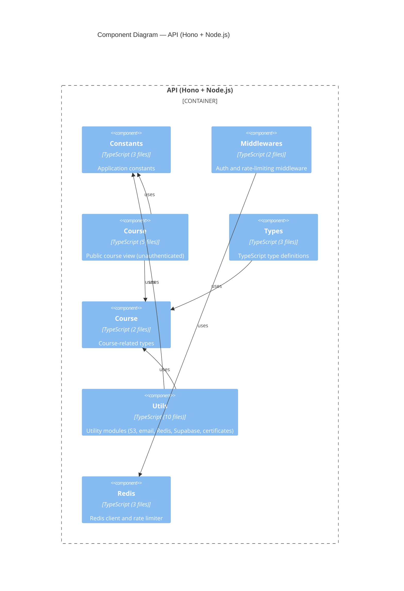

# C4 Layer 3 — API Components

Extracted from `apps/api/src` at depth=2. Generated 2026-05-15T07:34:04.647Z.

```mermaid
C4Component
    title Component Diagram — API (Hono + Node.js)

    Container_Boundary(api, "API (Hono + Node.js)") {
        Component(constants, "Constants", "TypeScript (3 files)", "Application constants")
        Component(middlewares, "Middlewares", "TypeScript (2 files)", "Auth and rate-limiting middleware")
        Component(routes_course, "Course", "TypeScript (5 files)", "Public course view (unauthenticated)")
        Component(types, "Types", "TypeScript (3 files)", "TypeScript type definitions")
        Component(types_course, "Course", "TypeScript (2 files)", "Course-related types")
        Component(utils, "Utils", "TypeScript (10 files)", "Utility modules (S3, email, Redis, Supabase, certificates)")
        Component(utils_redis, "Redis", "TypeScript (3 files)", "Redis client and rate limiter")
    }

    Rel(middlewares, utils_redis, "uses")
    Rel(routes_course, constants, "uses")
    Rel(routes_course, types_course, "uses")
    Rel(types, types_course, "uses")
    Rel(utils, constants, "uses")
    Rel(utils, types_course, "uses")
```
