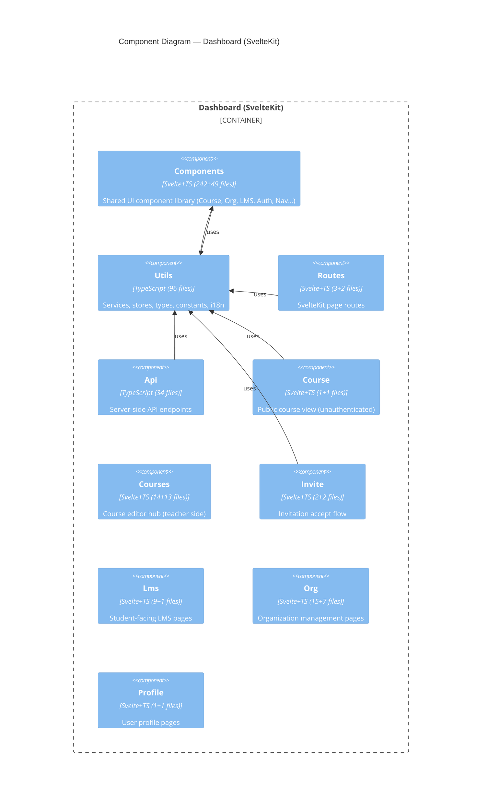

# C4 Layer 3 — Dashboard Components

Extracted from `apps/dashboard/src` at depth=5. Generated 2026-05-15T07:34:02.349Z.

```mermaid
C4Component
    title Component Diagram — Dashboard (SvelteKit)

    Container_Boundary(dashboard, "Dashboard (SvelteKit)") {
        Component(lib_components, "Components", "Svelte+TS (242+49 files)", "Shared UI component library (Course, Org, LMS, Auth, Nav…)")
        Component(lib_utils, "Utils", "TypeScript (96 files)", "Services, stores, types, constants, i18n")
        Component(routes, "Routes", "Svelte+TS (3+2 files)", "SvelteKit page routes")
        Component(routes_api, "Api", "TypeScript (34 files)", "Server-side API endpoints")
        Component(routes_course, "Course", "Svelte+TS (1+1 files)", "Public course view (unauthenticated)")
        Component(routes_courses, "Courses", "Svelte+TS (14+13 files)", "Course editor hub (teacher side)")
        Component(routes_invite, "Invite", "Svelte+TS (2+2 files)", "Invitation accept flow")
        Component(routes_lms, "Lms", "Svelte+TS (9+1 files)", "Student-facing LMS pages")
        Component(routes_org, "Org", "Svelte+TS (15+7 files)", "Organization management pages")
        Component(routes_profile, "Profile", "Svelte+TS (1+1 files)", "User profile pages")
    }

    Rel(lib_components, lib_utils, "uses")
    Rel(lib_utils, lib_components, "uses")
    Rel(routes, lib_utils, "uses")
    Rel(routes_api, lib_utils, "uses")
    Rel(routes_course, lib_utils, "uses")
    Rel(routes_invite, lib_utils, "uses")
```
