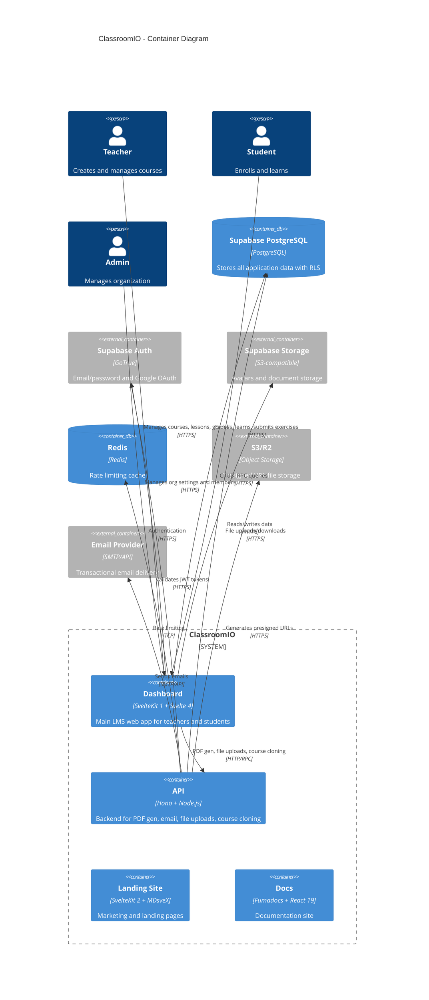

# C4 Layer 2: Container — ClassroomIO

Shows the internal containers of ClassroomIO and how they interact.

```mermaid
C4Container
    title ClassroomIO - Container Diagram

    Person(teacher, "Teacher", "Creates and manages courses")
    Person(student, "Student", "Enrolls and learns")
    Person(admin, "Admin", "Manages organization")

    System_Boundary(classroomio, "ClassroomIO") {
        Container(dashboard, "Dashboard", "SvelteKit 1 + Svelte 4", "Main LMS web app for teachers and students")
        Container(api, "API", "Hono + Node.js", "Backend for PDF gen, email, file uploads, course cloning")
        Container(landing, "Landing Site", "SvelteKit 2 + MDsveX", "Marketing and landing pages")
        Container(docs, "Docs", "Fumadocs + React 19", "Documentation site")
    }

    ContainerDb(supabase-db, "Supabase PostgreSQL", "PostgreSQL", "Stores all application data with RLS")
    Container_Ext(supabase-auth, "Supabase Auth", "GoTrue", "Email/password and Google OAuth")
    Container_Ext(supabase-storage, "Supabase Storage", "S3-compatible", "Avatars and document storage")
    ContainerDb(redis, "Redis", "Redis", "Rate limiting cache")
    Container_Ext(s3-r2, "S3/R2", "Object Storage", "Presigned URL file storage")
    Container_Ext(email-provider, "Email Provider", "SMTP/API", "Transactional email delivery")

    Rel(teacher, dashboard, "Manages courses, lessons, grades", "HTTPS")
    Rel(student, dashboard, "Enrolls, learns, submits exercises", "HTTPS")
    Rel(admin, dashboard, "Manages org settings and members", "HTTPS")

    Rel(dashboard, api, "PDF gen, file uploads, course cloning", "HTTP/RPC")
    Rel(dashboard, supabase-db, "CRUD, RPC queries", "HTTPS")
    Rel(dashboard, supabase-auth, "Authentication", "HTTPS")
    Rel(dashboard, supabase-storage, "File uploads/downloads", "HTTPS")

    Rel(api, supabase-db, "Reads/writes data", "HTTPS")
    Rel(api, supabase-auth, "Validates JWT tokens", "HTTPS")
    Rel(api, redis, "Rate limiting", "TCP")
    Rel(api, s3-r2, "Generates presigned URLs", "HTTPS")
    Rel(api, email-provider, "Sends emails", "SMTP/API")
```

---
*Generated on 2026-03-13*
