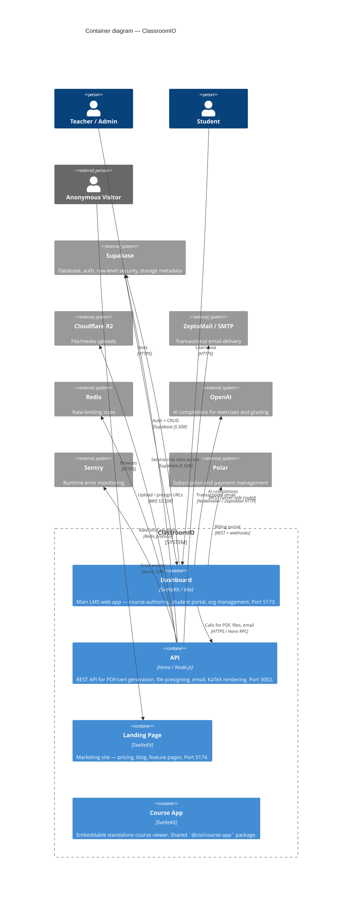

# C4 Level 2 — Containers

```mermaid
C4Container
  title Container diagram — ClassroomIO

  Person(p_teacher, "Teacher / Admin")
  Person(p_student, "Student")
  Person_Ext(p_anon, "Anonymous Visitor")

  System_Boundary(sb, "ClassroomIO") {
    Container(c_dashboard, "Dashboard", "SvelteKit / Vite", "Main LMS web app — course authoring, student portal, org management. Port 5173.")
    Container(c_api, "API", "Hono / Node.js", "REST API for PDF/cert generation, file presigning, email, KaTeX rendering. Port 3002.")
    Container(c_landing, "Landing Page", "SvelteKit", "Marketing site — pricing, blog, feature pages. Port 5174.")
    Container(c_courseapp, "Course App", "SvelteKit", "Embeddable standalone course viewer. Shared `@cio/course-app` package.")
  }

  System_Ext(ext_supabase, "Supabase", "Database, auth, row-level security, storage metadata")
  System_Ext(ext_r2, "Cloudflare R2", "File/media uploads")
  System_Ext(ext_smtp, "ZeptoMail / SMTP", "Transactional email delivery")
  System_Ext(ext_redis, "Redis", "Rate-limiting state")
  System_Ext(ext_openai, "OpenAI", "AI completions for exercises and grading")
  System_Ext(ext_sentry, "Sentry", "Runtime error monitoring")
  System_Ext(ext_polar, "Polar", "Subscription and payment management")

  Rel(p_teacher, c_dashboard, "Uses", "HTTPS")
  Rel(p_student, c_dashboard, "Learns via", "HTTPS")
  Rel(p_anon, c_landing, "Browses", "HTTPS")
  Rel(c_dashboard, c_api, "Calls for PDF, files, email", "HTTPS / Hono RPC")
  Rel(c_dashboard, ext_supabase, "Auth + CRUD", "Supabase JS SDK")
  Rel(c_dashboard, ext_openai, "AI completions", "REST (server-side route)")
  Rel(c_dashboard, ext_polar, "Billing portal", "REST + webhooks")
  Rel(c_api, ext_supabase, "Service-role data access", "Supabase JS SDK")
  Rel(c_api, ext_r2, "Upload / presign URLs", "AWS S3 SDK")
  Rel(c_api, ext_smtp, "Transactional email", "Nodemailer / ZeptoMail HTTP")
  Rel(c_api, ext_redis, "Rate-limit counters", "Redis protocol")
  Rel(c_api, ext_sentry, "Error events", "Sentry SDK")

  UpdateLayoutConfig($c4ShapeInRow="4", $c4BoundaryInRow="2")
```
