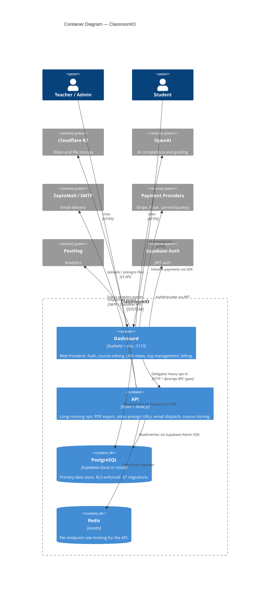

# C4 Layer 2 — Containers

Runtime containers that make up ClassroomIO and how they communicate.

```mermaid
C4Container
    title Container Diagram — ClassroomIO

    Person(teacher, "Teacher / Admin")
    Person(student, "Student")

    System_Boundary(classroomio, "ClassroomIO") {
        Container(dashboard, "Dashboard", "SvelteKit + Vite, :5173", "Web frontend. Auth, course editing, LMS views, org management, billing.")
        Container(api, "API", "Hono + Node.js", "Long-running ops: PDF export, video presign URLs, email dispatch, course cloning.")
        ContainerDb(db, "PostgreSQL", "Supabase (local or cloud)", "Primary data store. RLS-enforced. 37 migrations.")
        ContainerDb(redis_db, "Redis", "ioredis", "Per-endpoint rate limiting for the API.")
    }

    System_Ext(cloudflare_r2, "Cloudflare R2", "Video and file storage")
    System_Ext(openai, "OpenAI", "AI completions and grading")
    System_Ext(email_svc, "ZeptoMail / SMTP", "Email delivery")
    System_Ext(payment_svc, "Payment Providers", "Stripe, Polar, LemonSqueezy")
    System_Ext(posthog, "PostHog", "Analytics")
    System_Ext(supabase_auth, "Supabase Auth", "JWT auth")

    Rel(teacher, dashboard, "Uses", "HTTPS")
    Rel(student, dashboard, "Uses", "HTTPS")
    Rel(dashboard, db, "Reads/writes via Supabase JS SDK")
    Rel(dashboard, supabase_auth, "Authenticates via JWT")
    Rel(dashboard, api, "Delegates heavy ops to", "HTTP + @cio/api RPC types")
    Rel(dashboard, openai, "AI completions", "HTTP")
    Rel(dashboard, payment_svc, "Initiates payments via SDK")
    Rel(dashboard, posthog, "Tracks analytics events")
    Rel(api, db, "Reads/writes via Supabase Admin SDK")
    Rel(api, redis_db, "Rate-limits requests")
    Rel(api, cloudflare_r2, "Uploads / presigns files", "S3 API")
    Rel(api, email_svc, "Dispatches emails", "SMTP / ZeptoMail API")
```
