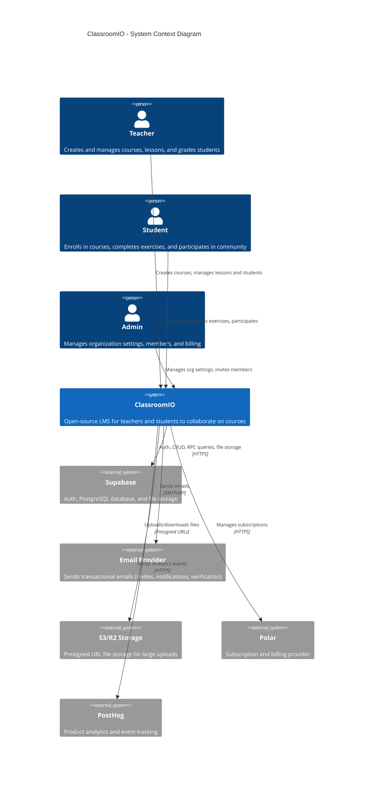

# C4 Layer 1: System Context — ClassroomIO

Shows ClassroomIO as a system with its external actors and dependencies.

```mermaid
C4Context
    title ClassroomIO - System Context Diagram

    Person(teacher, "Teacher", "Creates and manages courses, lessons, and grades students")
    Person(student, "Student", "Enrolls in courses, completes exercises, and participates in community")
    Person(admin, "Admin", "Manages organization settings, members, and billing")

    System(classroomio, "ClassroomIO", "Open-source LMS for teachers and students to collaborate on courses")

    System_Ext(supabase, "Supabase", "Auth, PostgreSQL database, and file storage")
    System_Ext(email-provider, "Email Provider", "Sends transactional emails (invites, notifications, verification)")
    System_Ext(s3-r2, "S3/R2 Storage", "Presigned URL file storage for large uploads")
    System_Ext(polar, "Polar", "Subscription and billing provider")
    System_Ext(posthog, "PostHog", "Product analytics and event tracking")

    Rel(teacher, classroomio, "Creates courses, manages lessons and students")
    Rel(student, classroomio, "Enrolls, completes exercises, participates")
    Rel(admin, classroomio, "Manages org settings, invites members")
    Rel(classroomio, supabase, "Auth, CRUD, RPC queries, file storage", "HTTPS")
    Rel(classroomio, email-provider, "Sends emails", "SMTP/API")
    Rel(classroomio, s3-r2, "Uploads/downloads files", "Presigned URLs")
    Rel(classroomio, polar, "Manages subscriptions", "HTTPS")
    Rel(classroomio, posthog, "Sends analytics events", "HTTPS")
```

---
*Generated on 2026-03-13*
