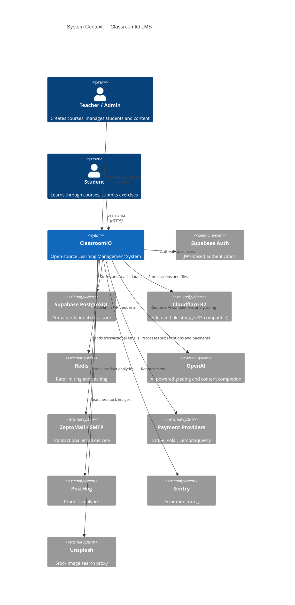

# C4 Layer 1 — System Context

External actors and systems ClassroomIO interacts with.

```mermaid
C4Context
    title System Context — ClassroomIO LMS

    Person(teacher, "Teacher / Admin", "Creates courses, manages students and content")
    Person(student, "Student", "Learns through courses, submits exercises")

    System(classroomio, "ClassroomIO", "Open-source Learning Management System")

    System_Ext(supabase_auth, "Supabase Auth", "JWT-based authentication")
    System_Ext(supabase_db, "Supabase PostgreSQL", "Primary relational data store")
    System_Ext(cloudflare_r2, "Cloudflare R2", "Video and file storage (S3-compatible)")
    System_Ext(redis, "Redis", "Rate limiting and caching")
    System_Ext(openai, "OpenAI", "AI-powered grading and content completion")
    System_Ext(email_svc, "ZeptoMail / SMTP", "Transactional email delivery")
    System_Ext(payment, "Payment Providers", "Stripe, Polar, LemonSqueezy")
    System_Ext(posthog, "PostHog", "Product analytics")
    System_Ext(sentry, "Sentry", "Error monitoring")
    System_Ext(unsplash, "Unsplash", "Stock image search proxy")

    Rel(teacher, classroomio, "Manages courses via", "HTTPS")
    Rel(student, classroomio, "Learns via", "HTTPS")
    Rel(classroomio, supabase_auth, "Authenticates users")
    Rel(classroomio, supabase_db, "Stores and reads data")
    Rel(classroomio, cloudflare_r2, "Stores videos and files")
    Rel(classroomio, redis, "Rate-limits API requests")
    Rel(classroomio, openai, "Requests AI completions and grading")
    Rel(classroomio, email_svc, "Sends transactional emails")
    Rel(classroomio, payment, "Processes subscriptions and payments")
    Rel(classroomio, posthog, "Tracks product analytics")
    Rel(classroomio, sentry, "Reports errors")
    Rel(classroomio, unsplash, "Searches stock images")
```
