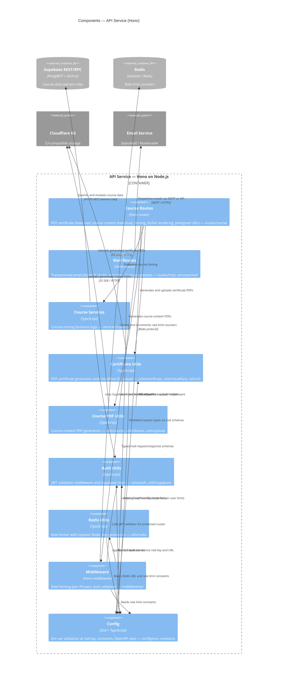

# C4 — Layer 3: API Components

> Generated by `/c4-model` skill on 2026-03-13.
> Source: AST extracted from `apps/api` (30 raw components → 9 aggregated groups).
> Refresh: run `/c4-model` in Claude Code.

## Diagram

## Notes

- `utils/openapi` is folded into Config (generates OpenAPI spec from env metadata)
- `utils/genUniqueId.ts`, `utils/email.ts`, `utils/mail.ts` folded into MailRoutes/CertUtils as leaf utilities
- `services/mail.ts` folded into MailRoutes group (mail service used only by the mail router)
- Root files `app.ts`, `index.ts`, `rpc-types.ts` are app bootstrap and type export — omitted from component diagram
- Middleware stack order: Logger → Pretty JSON → Secure Headers → CORS → Rate Limiter
