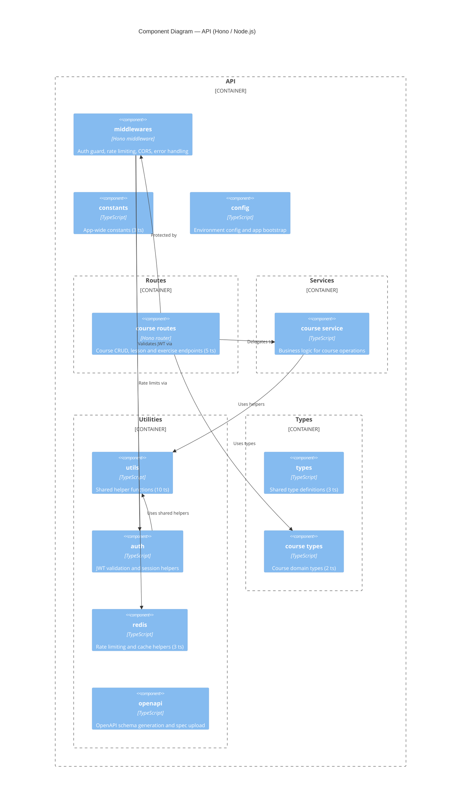

# C4 Layer 3 — API Components

> Derived from AST extraction. Run `/c4-model components` to refresh.
>
> Pruning applied: 14 raw components → 11 nodes.
> Dropped: `src-root` (entry glue), `routes` index (1 ts, no relations), `services` index (1 ts, no relations).

