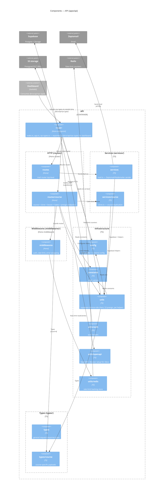

# C4 Layer 3 — Components: API

Components inside `apps/api`. Derived deterministically from the import graph by `.claude/skills/c4-model/scripts/extract-components.ts` at depth 2 from `apps/api/src`. The API surface is small — 14 components, 33 internal edges — so the diagram and roster cover the entire app.

## Diagram

```mermaid
C4Component
    title Components — API (apps/api)

    Container_Boundary(api, "API") {
        Boundary(http, "HTTP (routes/)", "Hono router") {
            Component(routes, "routes", "Hono", "mail router top-level")
            Component(routes_course, "routes/course", "Hono", "course + clone + lesson + katex + presign endpoints")
        }

        Boundary(svc, "Services (services/)", "TS") {
            Component(services, "services", "TS", "mail.ts — Zeptomail/Nodemailer sender")
            Component(services_course, "services/course", "TS", "clone.ts — course duplication")
        }

        Boundary(mw, "Middlewares (middlewares/)", "Hono middleware") {
            Component(middlewares, "middlewares", "Hono", "auth, rate-limit, error wrapping")
        }

        Boundary(infra, "Infrastructure", "TS") {
            Component(config, "config", "TS", "env loader + runtime config")
            Component(constants, "constants", "TS", "static values")
            Component(utils, "utils", "TS", "supabase service-role client, S3 presign, jwt helpers")
            Component(utils_auth, "utils/auth", "TS", "auth helpers")
            Component(utils_openapi, "utils/openapi", "TS", "OpenAPI / @scalar setup for /docs")
            Component(utils_redis, "utils/redis", "TS", "rate-limit backing store")
        }

        Boundary(typ, "Types (types/)", "TS") {
            Component(types, "types", "TS", "general request/response types")
            Component(types_course, "types/course", "TS", "course-specific payloads")
        }

        Component(root, "<root>", "Hono entrypoint", "index.ts, app.ts, rpc-types.ts — exported as @cio/api/rpc-types for dashboard")
    }

    System_Ext(supabase, "Supabase", "Postgres + Storage")
    System_Ext(zeptomail, "Zeptomail", "Email")
    System_Ext(s3, "S3 storage", "Presigned PUT URLs")
    System_Ext(redis, "Redis", "Rate-limit counters")
    Container_Ext(dashboard, "Dashboard", "SvelteKit", "Consumes @cio/api/rpc-types")

    Rel(root, config, "Loads env at boot")
    Rel(root, routes_course, "Mounts router")
    Rel(root, routes, "Mounts mail router")
    Rel(root, utils_openapi, "Configures /docs")
    Rel(routes_course, utils, "Uses helpers", "count=6")
    Rel(routes_course, types_course, "Types", "count=4")
    Rel(routes_course, middlewares, "Guards routes")
    Rel(routes_course, constants, "Reads constants")
    Rel(routes_course, services_course, "Calls clone service")
    Rel(routes, services, "Sends mail via")
    Rel(services, utils, "Supabase + helpers")
    Rel(services_course, utils, "Supabase helpers")
    Rel(middlewares, utils_redis, "Rate-limit reads/writes")
    Rel(utils, config, "Reads env")
    Rel(utils, constants, "Reads constants")
    Rel(utils, types_course, "Types")
    Rel(utils_auth, supabase, "Verifies JWTs", "supabase-js")
    Rel(services, zeptomail, "Sends mail", "HTTPS")
    Rel(utils, s3, "Presigns PUTs")
    Rel(utils_redis, redis, "Rate-limit counters")
    Rel(dashboard, root, "Imports rpc-types at compile time", "@cio/api/rpc-types")
```

## What this tells you

- **The API is a thin shell.** 33 routes/services across 14 components. There is no domain model beyond what's needed for the three jobs the API exists for: send mail, presign uploads, clone courses.
- **`utils` is the in-process Supabase client.** It holds the service-role client (different from the dashboard's anon client) plus S3 presign helpers and shared validators.
- **`<root>` (`src/app.ts`, `src/index.ts`, `src/rpc-types.ts`) is the boot + RPC-type export surface.** The exported `rpc-types.ts` is what makes the dashboard's `hcWithType` end-to-end typed.
- **`/docs` is served from `utils/openapi`** using `hono-openapi` + `@scalar/hono-api-reference`. CLAUDE.md misremembers the API as Express; it isn't.

## External dependencies (notable)

| Package | Import sites | Why it matters |
| --- | --- | --- |
| `hono` | 19 | Web framework. Routes, middleware, RPC types. |
| `@supabase/supabase-js` | 4 | Service-role client for DB writes the browser can't make. |
| `nodemailer` | 3 | Underlying SMTP transport behind the mail service. |

## Full component roster

| Component | Files | In-degree | Notes |
| --- | --- | --- | --- |
| `<root>` | 3 | — | `index.ts` (boot), `app.ts` (Hono app), `rpc-types.ts` (exported to dashboard) |
| `routes` | 1 | 1 | `mail.ts` mail router |
| `routes/course` | 5 | 1 | `course.ts`, `clone.ts`, `lesson.ts`, `katex.ts`, `presign.ts` |
| `services` | 1 | 1 | `mail.ts` — Zeptomail/Nodemailer sender |
| `services/course` | 1 | 1 | `clone.ts` — course duplication logic |
| `middlewares` | 2 | 3 | Hono middleware (auth, rate-limit) |
| `utils` | 10 | 11 | Service-role Supabase client, S3 presign, jwt, validators |
| `utils/auth` | 1 | 1 | Auth-specific helpers |
| `utils/openapi` | 1 | 1 | `/docs` configuration |
| `utils/redis` | 3 | 2 | Rate-limit counters |
| `config` | 1 | 8 | env loader |
| `constants` | 3 | 7 | Static values |
| `types` | 3 | 4 | Shared request/response types |
| `types/course` | 2 | 8 | Course-specific payloads (imported by dashboard via rpc-types) |
