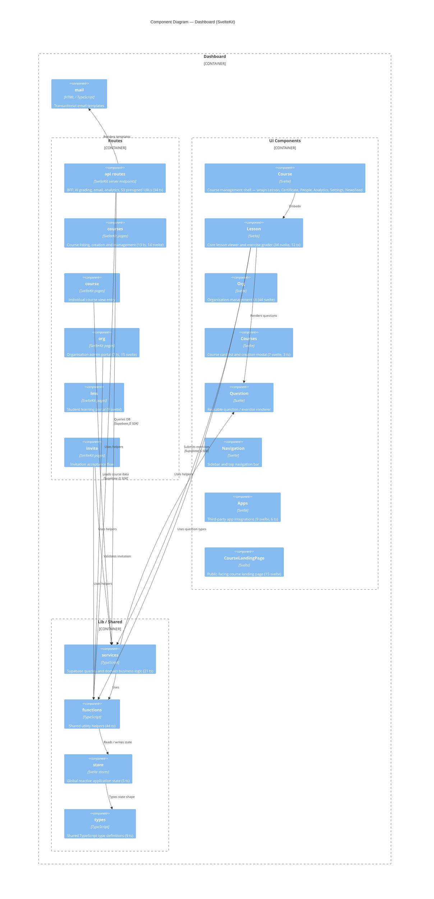

# C4 Layer 3 — Dashboard Components

> Derived from AST extraction. Run `/c4-model components` to refresh.
>
> Pruning applied: 97 raw components → 19 nodes.
> Dropped: single-file UI atoms (Avatar, Modal, Chip, etc.), auth stubs (login/logout/signup/404),
> all `lib/mocks/*` sub-groups (test fixtures only), and trivial barrel files.

