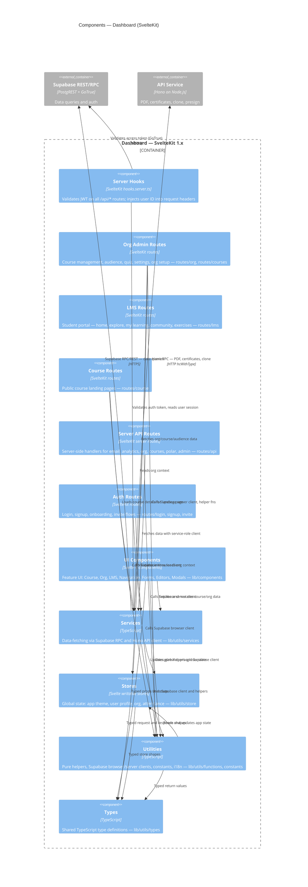

# C4 — Layer 3: Dashboard Components

> Generated by `/c4-model` skill on 2026-03-13.
> Source: AST extracted from `apps/dashboard` (96 raw components → 11 aggregated groups).
> Refresh: run `/c4-model` in Claude Code.

## Diagram

## Notes

- `lib/components/Course` has 83 files (15 .ts + 68 .svelte) — largest component group; consider reviewing if depth-3 extraction should be increased for more granular Layer 3 breakdown
- `mail/sendEmail.ts` (dashboard-side email util) is folded into Services group
- Root layout files (`routes/+layout.server.ts`, `routes/+layout.ts`) folded into OrgAdminRoutes for diagram clarity
- Circular dependencies exist between UIComponents ↔ Utilities ↔ Services; this is typical for SvelteKit apps with shared helpers
- `ServerAPIRoutes` uses `getServerSupabase()` (service-role client) — these routes bypass RLS
