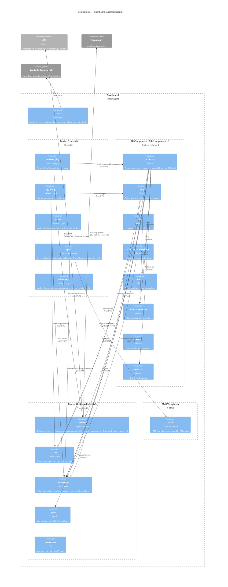

# C4 Layer 3 — Components: Dashboard

Components inside `apps/dashboard`. Derived deterministically from the import graph by `.claude/skills/c4-model/scripts/extract-components.ts` at depth 3 from `apps/dashboard/src`. Rerun the skill rather than hand-editing — the component list and edges in this file are the **product** of that extraction.

The diagram shows the most-connected components and the highest-weight cross-component edges. The full component roster (all 92 components) is listed below, grouped by boundary.

## Diagram

```mermaid
C4Component
    title Components — Dashboard (apps/dashboard)

    Container_Boundary(dash, "Dashboard") {
        Boundary(rt, "Routes (routes/)", "SvelteKit") {
            Component(routes_courses_id, "courses/[id]", "SvelteKit page", "Course detail / enrolled experience")
            Component(routes_org_slug, "org/[slug]", "SvelteKit page", "Org admin and tutor surfaces")
            Component(routes_lms, "lms/*", "SvelteKit page", "Student-facing community, mylearning, explore")
            Component(routes_api, "api/*", "SvelteKit endpoints", "Server-side API: email, polar webhooks, OpenAI proxy, unsplash, verify")
            Component(routes_invite, "invite/(s|t)", "SvelteKit page", "Student/tutor invite acceptance via unsigned base64 hashes")
        }

        Boundary(ui, "UI Components (lib/components/)", "Svelte 4 + Carbon") {
            Component(comp_Course, "Course", "Svelte", "Course authoring + viewer — largest UI surface (91 files)")
            Component(comp_Org, "Org", "Svelte", "Org settings, members, billing screens")
            Component(comp_Apps, "Apps", "Svelte", "In-course apps (Poll, etc.)")
            Component(comp_CourseLandingPage, "CourseLandingPage", "Svelte", "Public-facing course landing")
            Component(comp_Form, "Form", "Svelte", "Form primitives, used everywhere")
            Component(comp_PrimaryButton, "PrimaryButton", "Svelte", "Most-used button primitive")
            Component(comp_Icons, "Icons", "Svelte", "Icon sprites and wrappers")
            Component(comp_Snackbar, "Snackbar", "Svelte", "Toast notifications")
        }

        Boundary(util, "Shared Utilities (lib/utils/)", "TypeScript") {
            Component(util_services, "services", "Supabase client", "Data-access layer — Supabase queries grouped by domain (org, courses, lms, marks, attendance, …)")
            Component(util_store, "store", "Svelte stores", "Global state: user, org, app, attendance")
            Component(util_functions, "functions", "TS helpers", "Helpers including supabase.server, course math, validators")
            Component(util_types, "types", "TS types", "Shared types incl. Polar/AI payloads")
            Component(util_constants, "constants", "TS", "Numeric role IDs, plan IDs, etc.")
        }

        Boundary(mail, "Mail Templates", "HTML") {
            Component(mail_tpl, "mail", "Static templates", "HTML templates consumed by API mailer")
        }

        Component(root, "<root>", "Server hooks", "hooks.server.ts, ambient.d.ts, app.html — bootstraps SvelteKit")
    }

    Container_Ext(api, "API", "Hono", "Imported via @cio/api/rpc-types for typed client")
    System_Ext(supabase, "Supabase", "supabase-js anon key")
    System_Ext(sveltekit, "SvelteKit framework", "$app, $env virtual modules; @sveltejs/kit")

    Rel(routes_courses_id, comp_Course, "Renders course UI", "count=49")
    Rel(routes_org_slug, comp_Org, "Renders org UI", "count=16")
    Rel(routes_courses_id, util_services, "Loads course data via", "count=10")
    Rel(routes_org_slug, util_functions, "Uses helpers", "count=27")
    Rel(routes_org_slug, util_store, "Reads org/user state", "count=25")
    Rel(routes_api, mail_tpl, "Renders email HTML from", "count=11")
    Rel(routes_api, util_functions, "Uses server-side supabase helper", "count=14")

    Rel(comp_Course, util_functions, "Helpers", "count=72")
    Rel(comp_Course, util_store, "Reads stores", "count=31")
    Rel(comp_Course, util_services, "Queries Supabase via", "count=22")
    Rel(comp_Course, util_types, "Types", "count=38")
    Rel(comp_Course, comp_PrimaryButton, "Uses", "count=47")
    Rel(comp_Course, comp_Form, "Uses", "count=21")
    Rel(comp_Course, comp_Snackbar, "Notifies via", "count=15")
    Rel(comp_Org, util_functions, "Helpers", "count=54")
    Rel(comp_Org, util_store, "Reads stores", "count=33")
    Rel(comp_Org, comp_PrimaryButton, "Uses", "count=32")
    Rel(comp_CourseLandingPage, util_functions, "Helpers", "count=21")

    Rel(util_services, supabase, "anon-key queries", "RLS enforced server-side")
    Rel(util_services, util_functions, "Reuses helpers", "count=12")
    Rel(util_services, api, "Typed RPC", "hcWithType + @cio/api/rpc-types")
    Rel(root, sveltekit, "Hooks", "$app, $env")
```

## What this tells you

- **`lib/utils/services` is the data layer.** All Supabase access funnels through here. 84 incoming import sites, used by every major UI component and route. When touching data fetching, this is where to look.
- **`lib/utils/functions` is the swiss-army-knife.** 351 incoming import sites across 52 files. It contains `supabase.server` (the SSR helper used by `routes/api/*`), course-math helpers, validators, and assorted utilities. Likely overdue for splitting up.
- **`lib/components/Course` is the heaviest UI surface** — 91 files, 68 of them `.svelte`. The skill validator flags this as >50 files; bump `dashboard.depth` to 4 in `config.json` if you want to see it broken down by sub-feature (`Course/components/Lesson`, `Course/components/Analytics`, etc.).
- **Routes split cleanly**: `routes/api/*` are server endpoints (use SvelteKit's `+server.ts` pattern) while page routes (`routes/courses/[id]`, `routes/org/[slug]`, etc.) hit Supabase from the browser via `util_services`.
- **`@cio/api` cross-app import is one edge**: `lib/utils/services` imports `hcWithType` from `@cio/api/rpc-types` for compile-time-typed Hono RPC. This is the **only** code-level dependency from dashboard to API.

## External dependencies (notable)

| Package | Import sites | Why it matters |
| --- | --- | --- |
| `svelte` | 101 | Framework. Svelte 4 — not 5. |
| `@sveltejs/kit` | 31 | SvelteKit 1.x — load functions, server hooks, virtual modules. |
| `@supabase/supabase-js` | 11 | The browser ↔ data interface. Anon key, RLS-gated. |
| `@cio/api` | 2 | Typed RPC client for the API (cross-container link). |

`$app/*` and `$env/*` are SvelteKit virtual modules — present in many files but not counted as a package.

## Full component roster

92 components in total. Numbers are file counts (`svelte`/`script`).

### Routes (`routes/`)

| Component | Files (svelte/ts) | Notes |
| --- | --- | --- |
| `routes` | 5 (3/2) | Root `+layout.*`, `+error.svelte` |
| `routes/courses/[id]` | 27 (14/13) | Enrolled course view |
| `routes/org/[slug]` | 22 (15/7) | Org admin + tutor screens |
| `routes/api/email` | 11 (0/11) | Server endpoints that send mail |
| `routes/api/courses` | 7 (0/7) | Server endpoints around courses |
| `routes/api/completion` | 4 (0/4) | OpenAI streaming proxy |
| `routes/api/polar` | 3 (0/3) | Polar webhooks + portal |
| `routes/api/admin` | 2 (0/2) | Admin endpoints |
| `routes/api/analytics` | 2 (0/2) | Analytics ingest |
| `routes/api/org` | 2 (0/2) | Org-related endpoints |
| `routes/api/domain` | 1 (0/1) | Custom-domain check |
| `routes/api/unsplash` | 1 (0/1) | Unsplash search proxy |
| `routes/api/verify` | 1 (0/1) | Email verification |
| `routes/lms` | 2 (2/0) | Student-facing LMS root |
| `routes/lms/community` | 4 (3/1) | Community Q&A |
| `routes/lms/exercises` | 1 | Exercises list |
| `routes/lms/explore` | 1 | Browse courses |
| `routes/lms/mylearning` | 1 | Enrolled courses |
| `routes/lms/settings` | 1 | LMS settings |
| `routes/courses/[id]` | 27 | (see above) |
| `routes/course/[slug]` | 2 | Public course landing |
| `routes/invite/s` | 2 | Student invite redemption |
| `routes/invite/t` | 2 | Tutor invite redemption |
| `routes/profile/[id]` | 2 | Profile page |
| `routes/login`, `routes/signup`, `routes/logout`, `routes/forgot`, `routes/reset`, `routes/onboarding`, `routes/upgrade`, `routes/verify-email-error`, `routes/home`, `routes/404`, `routes/csp-report` | 1 each | Single-page routes |

### UI Components (`lib/components/`)

Top by file count or in-degree:

| Component | Files (svelte/ts) | In-degree |
| --- | --- | --- |
| `lib/components/Course` | 91 (68/23) | 62 |
| `lib/components/Org` | 46 (44/2) | 31 |
| `lib/components/CourseLandingPage` | 19 (15/4) | — |
| `lib/components/Icons` | 18 (18/0) | 25 |
| `lib/components/Apps` | 15 (9/6) | — |
| `lib/components/Courses` | 10 (7/3) | — |
| `lib/components/Form` | 8 (8/0) | 70 |
| `lib/components/Navigation` | 8 (7/1) | — |
| `lib/components/Question` | 7 (6/1) | — |
| `lib/components/Page` | 6 (5/1) | 18 |
| `lib/components/PrimaryButton` | 2 | 170 |
| `lib/components/Snackbar` | 3 | 54 |
| `lib/components/IconButton` | 1 | 36 |
| `lib/components/Modal` | 2 | 31 |
| `lib/components/Chip` | 3 | 21 |

Other components (1–4 files each): `AI`, `Analytics`, `AuthUI`, `Avatar`, `Backdrop`, `Box`, `Buttons`, `CodeSnippet`, `ComingSoon`, `Confetti`, `CourseContainer`, `Dropdown`, `ErrorMessage`, `Expandable`, `Footer`, `HTMLRender`, `HashTags`, `Hoverable`, `LMS`, `MarkdownEditor`, `OrgSelector`, `Progress`, `QuestionContainer`, `RoleBasedSecurity`, `Senja`, `TabContent`, `Tabs`, `TextEditor`, `ToolTip`, `UnsavedChanges`, `Upgrade`, `UploadImage`, `UploadWidget`, `Vote`, `WelcomeModal`.

### Shared Utilities (`lib/utils/`)

| Component | Files | In-degree | Responsibility |
| --- | --- | --- | --- |
| `lib/utils/functions` | 52 | 351 | Helpers — server supabase, validators, course math. ⚠ flagged by validator (>50 files). |
| `lib/utils/services` | 21 | 84 | Domain-scoped Supabase access (api, attendance, courses, dashboard, lms, marks, middlewares, newsfeed, notification, org, posthog, sentry, submissions) |
| `lib/utils/store` | 5 | 184 | Svelte stores: app, attendance, org, user, useMobile |
| `lib/utils/types` | 9 | 110 | Shared types (incl. PolarWebhookPayload) |
| `lib/utils/constants` | 9 | 45 | Numeric role IDs, plan IDs, app constants |

### Other

| Component | Files | Notes |
| --- | --- | --- |
| `mail` | 1 | Static HTML templates rendered by `routes/api/email` |
| `lib` | 1 | `lib/config.ts` — top-level lib config |
| `<root>` | 2 | `hooks.server.ts`, `app.postcss` |
