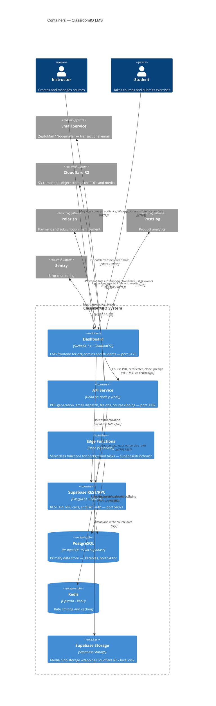

# C4 — Layer 2: Containers

> Generated by `/c4-model` skill on 2026-03-13.
> Source: AST extracted from `apps/dashboard` and `apps/api`.
> Refresh: run `/c4-model` in Claude Code.

## Diagram

## Notes

- Dashboard uses three data-access patterns: direct Supabase RPC (browser client), SvelteKit server API routes (service role), and Hono API client (`ApiClient` with `hcWithType` for type-safe RPC)
- `hooks.server.ts` validates all `/api/*` requests using Supabase access token before they reach SvelteKit server routes
- Build dependency: `dashboard` build depends on `api` build (RPC types exported via `@cio/api/rpc-types`)
- Supabase Storage wraps either Cloudflare R2 (production) or local disk (development) transparently
