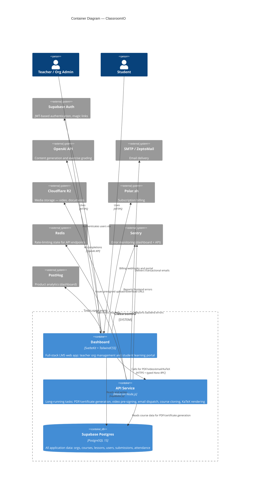

# C4 Layer 2 — Containers

```mermaid
C4Container
  title Container Diagram — ClassroomIO
  UpdateLayoutConfig($c4ShapeInRow="3", $c4BoundaryInRow="1")

  Person(teacher, "Teacher / Org Admin")
  Person(student, "Student")

  System_Boundary(cio, "ClassroomIO") {
    Container(dashboard, "Dashboard", "SvelteKit + TailwindCSS", "Full-stack LMS web app: teacher org management and student learning portal")
    Container(api, "API Service", "Hono on Node.js", "Long-running tasks: PDF/certificate generation, video pre-signing, email dispatch, course cloning, KaTeX rendering")
    ContainerDb(db, "Supabase Postgres", "PostgreSQL 15", "All application data: orgs, courses, lessons, users, submissions, attendance")
  }

  System_Ext(supabase_auth, "Supabase Auth", "JWT-based authentication, magic links")
  System_Ext(openai, "OpenAI API", "Content generation and exercise grading")
  System_Ext(email, "SMTP / ZeptoMail", "Email delivery")
  System_Ext(s3, "Cloudflare R2", "Media storage — video, documents")
  System_Ext(polar, "Polar.sh", "Subscription billing")
  System_Ext(redis, "Redis", "Rate-limiting state for API endpoints")
  System_Ext(sentry, "Sentry", "Error monitoring (dashboard + API)")
  System_Ext(posthog, "PostHog", "Product analytics (dashboard)")

  Rel(teacher, dashboard, "Uses", "HTTPS")
  Rel(student, dashboard, "Uses", "HTTPS")
  Rel(dashboard, api, "Calls for PDF/video/email/KaTeX", "HTTPS + typed Hono RPC")
  Rel(dashboard, db, "Reads and writes", "supabase-js")
  Rel(dashboard, supabase_auth, "Authenticates users via")
  Rel(dashboard, openai, "AI completions", "OpenAI API")
  Rel(dashboard, polar, "Billing webhooks and portal")
  Rel(dashboard, sentry, "Reports frontend errors")
  Rel(dashboard, posthog, "Tracks usage events")
  Rel(api, db, "Reads course data for PDF/certificate generation")
  Rel(api, email, "Delivers transactional emails")
  Rel(api, s3, "Issues presigned upload/download URLs")
  Rel(api, redis, "Rate-limits requests")
  Rel(api, sentry, "Reports backend errors")
```
