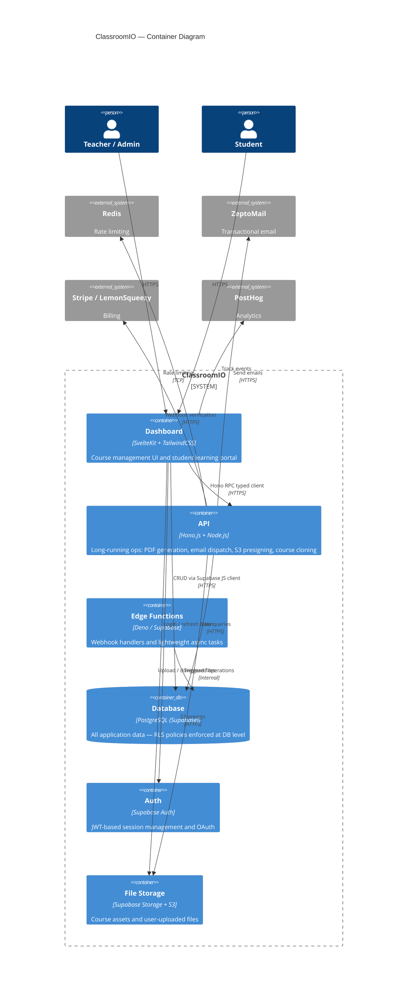

# Layer 2 — Containers

```mermaid
C4Container
  title ClassroomIO — Container Diagram

  Person(teacher, "Teacher / Admin")
  Person(student, "Student")

  System_Boundary(cio, "ClassroomIO") {
    Container(dashboard, "Dashboard", "SvelteKit + TailwindCSS", "Course management UI and student learning portal")
    Container(api, "API", "Hono.js + Node.js", "Long-running ops: PDF generation, email dispatch, S3 presigning, course cloning")
    Container(edge, "Edge Functions", "Deno / Supabase", "Webhook handlers and lightweight async tasks")
    ContainerDb(db, "Database", "PostgreSQL (Supabase)", "All application data — RLS policies enforced at DB level")
    Container(auth, "Auth", "Supabase Auth", "JWT-based session management and OAuth")
    Container(storage, "File Storage", "Supabase Storage + S3", "Course assets and user-uploaded files")
  }

  System_Ext(redis, "Redis", "Rate limiting")
  System_Ext(email, "ZeptoMail", "Transactional email")
  System_Ext(payments, "Stripe / LemonSqueezy", "Billing")
  System_Ext(posthog, "PostHog", "Analytics")

  Rel(teacher, dashboard, "HTTPS")
  Rel(student, dashboard, "HTTPS")
  Rel(dashboard, auth, "Login / refresh token")
  Rel(dashboard, db, "CRUD via Supabase JS client", "HTTPS")
  Rel(dashboard, api, "Hono RPC typed client", "HTTPS")
  Rel(dashboard, storage, "Upload / download files")
  Rel(dashboard, posthog, "Track events")
  Rel(api, db, "Data queries", "HTTPS")
  Rel(api, redis, "Rate limiting", "TCP")
  Rel(api, email, "Send emails", "HTTPS")
  Rel(api, storage, "S3 presign", "HTTPS")
  Rel(api, payments, "Webhook verification", "HTTPS")
  Rel(edge, db, "Triggered operations", "Internal")
```
