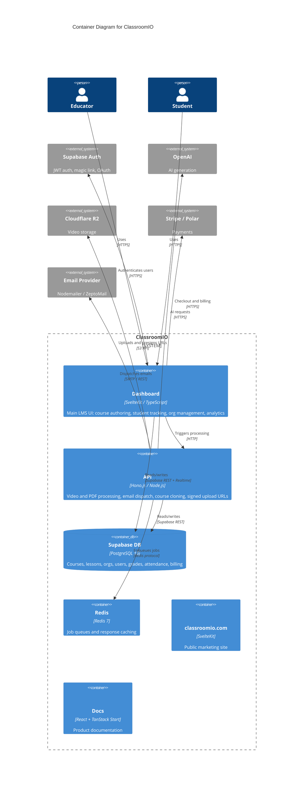

# C4 Level 2 — Containers

```mermaid
C4Container
  title Container Diagram for ClassroomIO

  Person(educator, "Educator")
  Person(student, "Student")

  System_Boundary(cio, "ClassroomIO") {
    Container(dashboard, "Dashboard", "SvelteKit / TypeScript", "Main LMS UI: course authoring, student tracking, org management, analytics", "port 5173")
    Container(api, "API", "Hono.js / Node.js", "Video and PDF processing, email dispatch, course cloning, signed upload URLs", "port 3002")
    ContainerDb(db, "Supabase DB", "PostgreSQL 15", "Courses, lessons, orgs, users, grades, attendance, billing")
    Container(redis, "Redis", "Redis 7", "Job queues and response caching")
    Container(marketing, "classroomio.com", "SvelteKit", "Public marketing site", "port 5174")
    Container(docs, "Docs", "React + TanStack Start", "Product documentation", "port 3000")
  }

  System_Ext(supabase_auth, "Supabase Auth", "JWT auth, magic link, OAuth")
  System_Ext(openai, "OpenAI", "AI generation")
  System_Ext(r2, "Cloudflare R2", "Video storage")
  System_Ext(stripe, "Stripe / Polar", "Payments")
  System_Ext(email_svc, "Email Provider", "Nodemailer / ZeptoMail")

  Rel(educator, dashboard, "Uses", "HTTPS")
  Rel(student, dashboard, "Uses", "HTTPS")
  Rel(dashboard, db, "Reads/writes", "Supabase REST + Realtime")
  Rel(dashboard, supabase_auth, "Authenticates users", "HTTPS")
  Rel(dashboard, api, "Triggers processing", "HTTP")
  Rel(api, db, "Reads/writes", "Supabase REST")
  Rel(api, redis, "Enqueues jobs", "Redis protocol")
  Rel(api, openai, "AI requests", "HTTPS")
  Rel(api, r2, "Uploads and presigns URLs", "S3 API")
  Rel(api, email_svc, "Dispatches emails", "SMTP / REST")
  Rel(dashboard, stripe, "Checkout and billing", "HTTPS")
```
