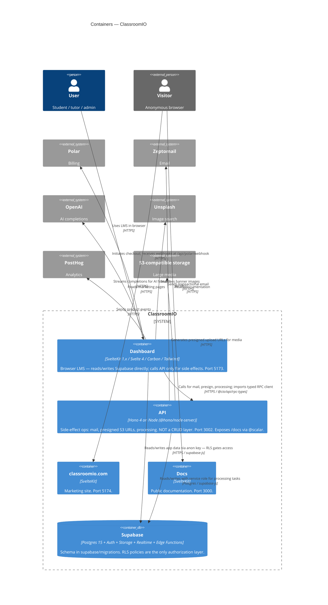

# C4 Layer 2 — Containers

Inside the ClassroomIO system. Each box is a deployable unit (pnpm workspace).

```mermaid
C4Container
    title Containers — ClassroomIO

    Person(user, "User", "Student / tutor / admin")
    Person_Ext(visitor, "Visitor", "Anonymous browser")

    System_Boundary(cio, "ClassroomIO") {
        Container(dashboard, "Dashboard", "SvelteKit 1.x / Svelte 4 / Carbon / Tailwind", "Browser LMS — reads/writes Supabase directly; calls API only for side effects. Port 5173.")
        Container(api, "API", "Hono 4 on Node (@hono/node-server)", "Side-effect ops: mail, presigned S3 URLs, processing. NOT a CRUD layer. Port 3002. Exposes /docs via @scalar.")
        Container(www, "classroomio.com", "SvelteKit", "Marketing site. Port 5174.")
        Container(docs, "Docs", "SvelteKit", "Public documentation. Port 3000.")
        ContainerDb(supabase, "Supabase", "Postgres 15 + Auth + Storage + Realtime + Edge Functions", "Schema in supabase/migrations. RLS policies are the only authorization layer.")
    }

    System_Ext(polar, "Polar", "Billing")
    System_Ext(zeptomail, "Zeptomail", "Email")
    System_Ext(openai, "OpenAI", "AI completions")
    System_Ext(unsplash, "Unsplash", "Image search")
    System_Ext(posthog, "PostHog", "Analytics")
    System_Ext(s3, "S3-compatible storage", "Large media")

    Rel(user, dashboard, "Uses LMS in browser", "HTTPS")
    Rel(visitor, www, "Reads marketing pages", "HTTPS")
    Rel(visitor, docs, "Reads documentation", "HTTPS")

    Rel(dashboard, supabase, "Reads/writes app data via anon key — RLS gates access", "HTTPS / supabase-js")
    Rel(dashboard, api, "Calls for mail, presign, processing; imports typed RPC client", "HTTPS / @cio/api/rpc-types")
    Rel(dashboard, polar, "Initiates checkout; receives webhooks at /api/polar/webhook", "HTTPS")
    Rel(dashboard, openai, "Streams completions for AI features", "HTTPS")
    Rel(dashboard, unsplash, "Searches banner images", "HTTPS")
    Rel(dashboard, posthog, "Sends product events", "HTTPS")

    Rel(api, supabase, "Reads/writes with service role for processing tasks", "Postgres / supabase-js")
    Rel(api, zeptomail, "Sends transactional email", "HTTPS")
    Rel(api, s3, "Generates presigned upload URLs for media", "HTTPS")
```

## Key relationships

- **`dashboard → supabase` is the hot path.** Most reads and writes happen directly from the browser. Don't expect a server-side CRUD layer; there isn't one. Authorization is RLS in Postgres.
- **`dashboard → api` is the exception path.** The API exists for things the browser cannot safely do (sending email with secrets, signing S3 PUTs, video/PDF processing). The dashboard imports `@cio/api/rpc-types` for compile-time typed Hono client (`hcWithType`).
- **Email is fire-and-forget** from the dashboard. The dashboard kicks off the API call without awaiting it for user-facing redirects (see CLAUDE.md). The API is the actual sender via Zeptomail/Nodemailer.
- **Build order** matters: `@cio/dashboard#build` depends on `@cio/api#build` because of the imported rpc-types. Turbo handles this.

## What's not shown

- Cypress / Playwright test runners (development-time only).
- `packages/shared`, `packages/course-app`, `packages/tsconfig` — internal libraries consumed at build time, not deployed units.
- `supabase/functions/` Edge Functions — folded into the Supabase container.
