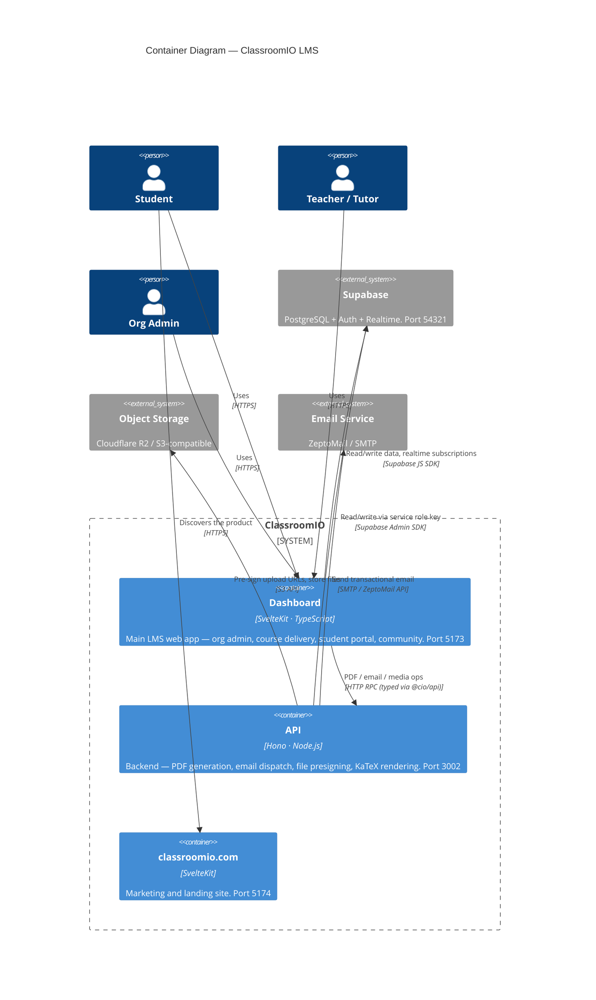

# C4 Layer 2 — Containers

```mermaid
C4Container
title Container Diagram — ClassroomIO LMS

Person(student, "Student")
Person(teacher, "Teacher / Tutor")
Person(admin, "Org Admin")

System_Boundary(cio, "ClassroomIO") {
  Container(dashboard, "Dashboard", "SvelteKit · TypeScript", "Main LMS web app — org admin, course delivery, student portal, community. Port 5173")
  Container(api, "API", "Hono · Node.js", "Backend — PDF generation, email dispatch, file presigning, KaTeX rendering. Port 3002")
  Container(website, "classroomio.com", "SvelteKit", "Marketing and landing site. Port 5174")
}

System_Ext(supabase, "Supabase", "PostgreSQL + Auth + Realtime. Port 54321")
System_Ext(storage, "Object Storage", "Cloudflare R2 / S3-compatible")
System_Ext(email_svc, "Email Service", "ZeptoMail / SMTP")

Rel(student, dashboard, "Uses", "HTTPS")
Rel(teacher, dashboard, "Uses", "HTTPS")
Rel(admin, dashboard, "Uses", "HTTPS")
Rel(dashboard, api, "PDF / email / media ops", "HTTP RPC (typed via @cio/api)")
Rel(dashboard, supabase, "Read/write data, realtime subscriptions", "Supabase JS SDK")
Rel(api, supabase, "Read/write via service role key", "Supabase Admin SDK")
Rel(api, storage, "Pre-sign upload URLs, store files", "S3 API")
Rel(api, email_svc, "Send transactional email", "SMTP / ZeptoMail API")
Rel(student, website, "Discovers the product", "HTTPS")
```
