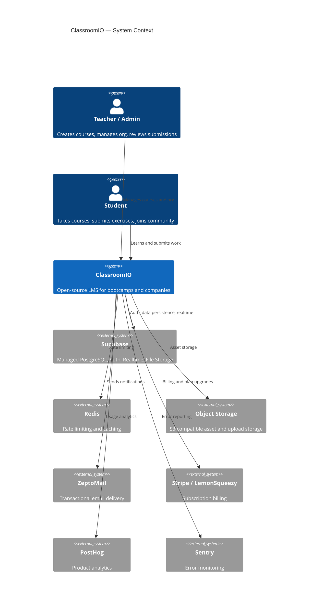

# Layer 1 — System Context

```mermaid
C4Context
  title ClassroomIO — System Context

  Person(teacher, "Teacher / Admin", "Creates courses, manages org, reviews submissions")
  Person(student, "Student", "Takes courses, submits exercises, joins community")

  System(cio, "ClassroomIO", "Open-source LMS for bootcamps and companies")

  System_Ext(supabase, "Supabase", "Managed PostgreSQL, Auth, Realtime, File Storage")
  System_Ext(redis, "Redis", "Rate limiting and caching")
  System_Ext(s3, "Object Storage", "S3-compatible asset and upload storage")
  System_Ext(email, "ZeptoMail", "Transactional email delivery")
  System_Ext(payments, "Stripe / LemonSqueezy", "Subscription billing")
  System_Ext(posthog, "PostHog", "Product analytics")
  System_Ext(sentry, "Sentry", "Error monitoring")

  Rel(teacher, cio, "Manages courses and org")
  Rel(student, cio, "Learns and submits work")
  Rel(cio, supabase, "Auth, data persistence, realtime")
  Rel(cio, redis, "Rate limiting")
  Rel(cio, s3, "Asset storage")
  Rel(cio, email, "Sends notifications")
  Rel(cio, payments, "Billing and plan upgrades")
  Rel(cio, posthog, "Usage analytics")
  Rel(cio, sentry, "Error reporting")
```
