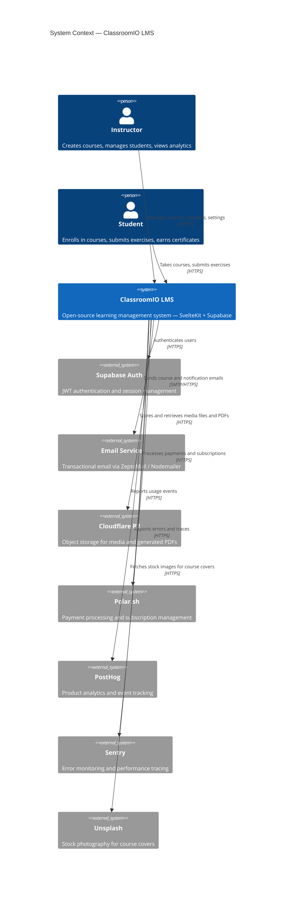

# C4 — Layer 1: System Context

> Generated by `/c4-model` skill on 2026-03-13.
> Source: AST extracted from `apps/dashboard` and `apps/api`.
> Refresh: run `/c4-model` in Claude Code.

## Diagram

## Notes

- ClassroomIO supports both cloud-hosted (Vercel) and self-hosted (Node.js adapter) deployments
- `PUBLIC_IS_SELFHOSTED` flag switches adapter and disables SSR for self-hosted mode
- Supabase Realtime (WebSocket subscriptions) used internally for newsfeed/notifications but omitted here for clarity
