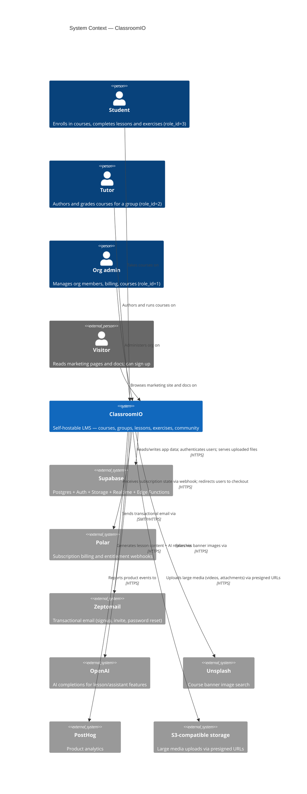

# C4 Layer 1 — System Context

ClassroomIO is a self-hostable learning management system. This diagram shows who uses it and which external systems it depends on. Open `containers.md` to look inside the ClassroomIO box.

```mermaid
C4Context
    title System Context — ClassroomIO

    Person(student, "Student", "Enrolls in courses, completes lessons and exercises (role_id=3)")
    Person(tutor, "Tutor", "Authors and grades courses for a group (role_id=2)")
    Person(orgAdmin, "Org admin", "Manages org members, billing, courses (role_id=1)")
    Person_Ext(visitor, "Visitor", "Reads marketing pages and docs; can sign up")

    System(classroomio, "ClassroomIO", "Self-hostable LMS — courses, groups, lessons, exercises, community")

    System_Ext(supabase, "Supabase", "Postgres + Auth + Storage + Realtime + Edge Functions")
    System_Ext(polar, "Polar", "Subscription billing and entitlement webhooks")
    System_Ext(zeptomail, "Zeptomail", "Transactional email (signup, invite, password reset)")
    System_Ext(openai, "OpenAI", "AI completions for lesson/assistant features")
    System_Ext(unsplash, "Unsplash", "Course banner image search")
    System_Ext(posthog, "PostHog", "Product analytics")
    System_Ext(s3, "S3-compatible storage", "Large media uploads via presigned URLs")

    Rel(student, classroomio, "Takes courses on")
    Rel(tutor, classroomio, "Authors and runs courses on")
    Rel(orgAdmin, classroomio, "Administers org on")
    Rel(visitor, classroomio, "Browses marketing site and docs on")

    Rel(classroomio, supabase, "Reads/writes app data; authenticates users; serves uploaded files", "HTTPS")
    Rel(classroomio, polar, "Receives subscription state via webhook; redirects users to checkout", "HTTPS")
    Rel(classroomio, zeptomail, "Sends transactional email via", "SMTP/HTTPS")
    Rel(classroomio, openai, "Generates lesson content + AI replies via", "HTTPS")
    Rel(classroomio, unsplash, "Searches banner images via", "HTTPS")
    Rel(classroomio, posthog, "Reports product events to", "HTTPS")
    Rel(classroomio, s3, "Uploads large media (videos, attachments) via presigned URLs", "HTTPS")
```

## Notes

- **Roles are numeric** (`groupmember.role_id`): `1=ADMIN`, `2=TUTOR`, `3=STUDENT`. Tutors and students share the `groupmember` table and are distinguished only by this column.
- **Authorization is enforced in Postgres RLS**, not in any JS middleware. From an L1 perspective, all role checks are inside the ClassroomIO/Supabase boundary.
- Supabase is treated as external in this diagram because in production it is a managed service. Locally it is `supabase start` Docker containers — see `database.md` for the schema.
