# C4 Level 3 — Components: Dashboard (SvelteKit)

_Extracted 2026-05-15 · depth=4_

```mermaid
C4Component
  title Component Diagram for Dashboard (SvelteKit)

  Container_Boundary(dash_boundary, "Dashboard (SvelteKit)") {
    Component(lib_mocks, "mocks", "2 TS", "lib/mocks")
    Component(lib_utils_functions, "functions", "47 TS", "lib/utils/functions")
    Component(lib_mocks_react, "react", "34 TS", "lib/mocks/react")
    Component(lib_mocks_css, "css", "21 TS", "lib/mocks/css")
    Component(lib_mocks_git, "git", "21 TS", "lib/mocks/git")
    Component(lib_mocks_html, "html", "21 TS", "lib/mocks/html")
    Component(lib_mocks_js, "js", "21 TS", "lib/mocks/js")
    Component(lib_mocks_node, "node", "21 TS", "lib/mocks/node")
    Component(lib_mocks_php, "php", "21 TS", "lib/mocks/php")
    Component(lib_mocks_python, "python", "21 TS", "lib/mocks/python")
    Component(lib_mocks_vue, "vue", "21 TS", "lib/mocks/vue")
    Component(lib_mocks_typescript, "typescript", "17 TS", "lib/mocks/typescript")
    Component(lib_utils_constants, "constants", "9 TS", "lib/utils/constants")
    Component(lib_utils_types, "types", "9 TS", "lib/utils/types")
    Component(lib_components_Course_components, "components", "68 Svelte, 20 TS", "lib/components/Course/components")
    Component(mail, "mail", "1 TS", "mail")
    Component(lib_utils_store, "store", "5 TS", "lib/utils/store")
    Component(routes_api_email_course, "course", "8 TS", "routes/api/email/course")
    Component(lib_utils_services_org, "org", "3 TS", "lib/utils/services/org")
    Component(lib_utils_services_courses, "courses", "3 TS", "lib/utils/services/courses")
    Component(routes, "routes", "3 Svelte, 2 TS", "routes")
    Component(routes_api_courses_analytics, "analytics", "1 TS", "routes/api/courses/analytics")
    Component(lib_utils_functions_routes, "routes", "4 TS", "lib/utils/functions/routes")
    Component(lib, "lib", "1 TS", "lib")
    Component(lib_components_Question, "Question", "3 Svelte, 1 TS", "lib/components/Question")
  }

  Rel(lib_mocks_react, lib_mocks, "33 imports")
  Rel(lib_mocks_css, lib_mocks, "20 imports")
  Rel(lib_mocks_git, lib_mocks, "20 imports")
  Rel(lib_mocks_html, lib_mocks, "20 imports")
  Rel(lib_mocks_js, lib_mocks, "20 imports")
  Rel(lib_mocks_node, lib_mocks, "20 imports")
  Rel(lib_mocks_php, lib_mocks, "20 imports")
  Rel(lib_mocks_python, lib_mocks, "20 imports")
  Rel(lib_mocks_vue, lib_mocks, "20 imports")
  Rel(lib_mocks_typescript, lib_mocks, "16 imports")
  Rel(routes_api_email_course, mail, "8 imports")
  Rel(lib_utils_functions, lib_utils_store, "imports")
  Rel(routes_api_courses_analytics, lib_utils_functions, "imports")
  Rel(lib_components_Course_components, lib_utils_functions, "imports")
  Rel(routes, lib_utils_functions, "imports")
  Rel(lib_utils_functions, lib_utils_constants, "imports")
  Rel(lib_utils_functions, lib_utils_functions_routes, "imports")
  Rel(lib_utils_functions, lib, "imports")
  Rel(lib_utils_store, lib_utils_constants, "imports")
  Rel(lib_utils_functions_routes, lib_utils_constants, "imports")
  Rel(lib_utils_services_courses, lib_utils_functions, "imports")
  Rel(lib_utils_services_org, lib_utils_types, "imports")
  Rel(lib_utils_services_org, lib_utils_store, "imports")
  Rel(routes_api_courses_analytics, lib_utils_types, "imports")
  Rel(lib_components_Course_components, lib_components_Question, "imports")
  Rel(lib, lib_utils_types, "imports")
  Rel(routes, lib_utils_types, "imports")
  Rel(routes, lib_utils_constants, "imports")
  Rel(routes, lib_utils_store, "imports")
  Rel(lib_utils_functions, lib_components_Course_components, "imports")
  Rel(lib_utils_store, lib_utils_types, "imports")
  Rel(lib_utils_services_courses, lib_components_Question, "imports")
  Rel(lib_utils_services_courses, lib_utils_constants, "imports")
  Rel(lib_utils_services_courses, lib_utils_store, "imports")
  Rel(lib_utils_services_courses, lib_components_Course_components, "imports")
  Rel(lib_utils_services_org, lib_utils_constants, "imports")
  Rel(lib_utils_services_org, lib_utils_functions, "imports")
  Rel(lib_components_Course_components, lib_utils_types, "imports")
  Rel(routes_api_email_course, lib_utils_functions, "imports")
```

## Component Inventory

| Component | TS | Svelte | Path |
|-----------|----:|-------:|------|
| Root | 1 | 0 | `_root` |
| lib | 1 | 0 | `lib` |
| Analytics | 1 | 3 | `lib/components/Analytics` |
| Apps | 2 | 1 | `lib/components/Apps` |
| components | 4 | 8 | `lib/components/Apps/components` |
| Confetti | 1 | 1 | `lib/components/Confetti` |
| Course | 3 | 0 | `lib/components/Course` |
| components | 20 | 68 | `lib/components/Course/components` |
| Course Landing Page | 3 | 1 | `lib/components/CourseLandingPage` |
| components | 1 | 14 | `lib/components/CourseLandingPage/components` |
| Courses | 3 | 1 | `lib/components/Courses` |
| Navigation | 1 | 7 | `lib/components/Navigation` |
| Org | 1 | 3 | `lib/components/Org` |
| Settings | 1 | 11 | `lib/components/Org/Settings` |
| Page | 1 | 5 | `lib/components/Page` |
| Primary Button | 1 | 1 | `lib/components/PrimaryButton` |
| Question | 1 | 3 | `lib/components/Question` |
| Snackbar | 2 | 1 | `lib/components/Snackbar` |
| Tinymce Svelte | 1 | 1 | `lib/components/TextEditor/TinymceSvelte` |
| Upload Widget | 1 | 1 | `lib/components/UploadWidget` |
| Welcome Modal | 1 | 1 | `lib/components/WelcomeModal` |
| mocks | 2 | 0 | `lib/mocks` |
| css | 21 | 0 | `lib/mocks/css` |
| git | 21 | 0 | `lib/mocks/git` |
| html | 21 | 0 | `lib/mocks/html` |
| js | 21 | 0 | `lib/mocks/js` |
| node | 21 | 0 | `lib/mocks/node` |
| php | 21 | 0 | `lib/mocks/php` |
| python | 21 | 0 | `lib/mocks/python` |
| react | 34 | 0 | `lib/mocks/react` |
| typescript | 17 | 0 | `lib/mocks/typescript` |
| vue | 21 | 0 | `lib/mocks/vue` |
| constants | 9 | 0 | `lib/utils/constants` |
| functions | 47 | 0 | `lib/utils/functions` |
| routes | 4 | 0 | `lib/utils/functions/routes` |
| tinymce | 1 | 0 | `lib/utils/functions/tinymce` |
| api | 4 | 0 | `lib/utils/services/api` |
| attendance | 1 | 0 | `lib/utils/services/attendance` |
| courses | 3 | 0 | `lib/utils/services/courses` |
| dashboard | 1 | 0 | `lib/utils/services/dashboard` |
| lms | 1 | 0 | `lib/utils/services/lms` |
| marks | 1 | 0 | `lib/utils/services/marks` |
| middlewares | 2 | 0 | `lib/utils/services/middlewares` |
| newsfeed | 1 | 0 | `lib/utils/services/newsfeed` |
| notification | 1 | 0 | `lib/utils/services/notification` |
| org | 3 | 0 | `lib/utils/services/org` |
| posthog | 1 | 0 | `lib/utils/services/posthog` |
| sentry | 1 | 0 | `lib/utils/services/sentry` |
| submissions | 1 | 0 | `lib/utils/services/submissions` |
| store | 5 | 0 | `lib/utils/store` |
| types | 9 | 0 | `lib/utils/types` |
| mail | 1 | 0 | `mail` |
| routes | 2 | 3 | `routes` |
| cleanup-tokens | 1 | 0 | `routes/api/admin/cleanup-tokens` |
| security-monitor | 1 | 0 | `routes/api/admin/security-monitor` |
| dash | 1 | 0 | `routes/api/analytics/dash` |
| user | 1 | 0 | `routes/api/analytics/user` |
| completion | 1 | 0 | `routes/api/completion` |
| customprompt | 1 | 0 | `routes/api/completion/customprompt` |
| exerciseprompt | 1 | 0 | `routes/api/completion/exerciseprompt` |
| gradingprompt | 1 | 0 | `routes/api/completion/gradingprompt` |
| analytics | 1 | 0 | `routes/api/courses/analytics` |
| data | 1 | 0 | `routes/api/courses/data` |
| exercises | 1 | 0 | `routes/api/courses/exercises` |
| marks | 1 | 0 | `routes/api/courses/marks` |
| newsfeed | 1 | 0 | `routes/api/courses/newsfeed` |
| submission | 1 | 0 | `routes/api/courses/submission` |
| submissions | 1 | 0 | `routes/api/courses/submissions` |
| domain | 1 | 0 | `routes/api/domain` |
| course | 8 | 0 | `routes/api/email/course` |
| invite | 1 | 0 | `routes/api/email/invite` |
| verify_email | 1 | 0 | `routes/api/email/verify_email` |
| welcome | 1 | 0 | `routes/api/email/welcome` |
| audience | 1 | 0 | `routes/api/org/audience` |
| team | 1 | 0 | `routes/api/org/team` |
| portal | 1 | 0 | `routes/api/polar/portal` |
| subscribe | 1 | 0 | `routes/api/polar/subscribe` |
| webhook | 1 | 0 | `routes/api/polar/webhook` |
| unsplash | 1 | 0 | `routes/api/unsplash` |
| verify | 1 | 0 | `routes/api/verify` |
| [slug] | 1 | 1 | `routes/course/[slug]` |
| [id] | 1 | 2 | `routes/courses/[id]` |
| analytics | 1 | 1 | `routes/courses/[id]/analytics` |
| attendance | 1 | 1 | `routes/courses/[id]/attendance` |
| certificates | 1 | 1 | `routes/courses/[id]/certificates` |
| landingpage | 1 | 1 | `routes/courses/[id]/landingpage` |
| lessons | 2 | 2 | `routes/courses/[id]/lessons` |
| marks | 1 | 1 | `routes/courses/[id]/marks` |
| people | 3 | 3 | `routes/courses/[id]/people` |
| settings | 1 | 1 | `routes/courses/[id]/settings` |
| submissions | 1 | 1 | `routes/courses/[id]/submissions` |
| csp-report | 1 | 0 | `routes/csp-report` |
| [hash] | 1 | 1 | `routes/invite/s/[hash]` |
| [hash] | 1 | 1 | `routes/invite/t/[hash]` |
| [slug] | 1 | 1 | `routes/lms/community/[slug]` |
| [slug] | 2 | 2 | `routes/org/[slug]` |
| audience | 1 | 2 | `routes/org/[slug]/audience` |
| community | 1 | 3 | `routes/org/[slug]/community` |
| courses | 1 | 1 | `routes/org/[slug]/courses` |
| quiz | 1 | 2 | `routes/org/[slug]/quiz` |
| setup | 1 | 1 | `routes/org/[slug]/setup` |
| [id] | 1 | 1 | `routes/profile/[id]` |
